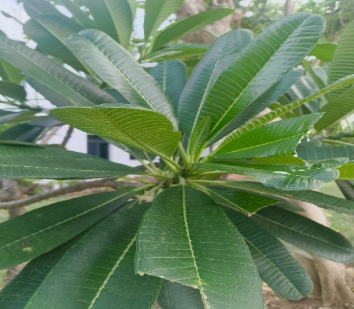

# White Champa / Frangipani (`Plumeria obtusa`)

| Field Attribute | Taxonomic / Ecological Specification |
| :--- | :--- |
| **Catalog ID** | `FL-01` |
| **Common Name** | White Champa / Frangipani |
| **Scientific Name** | *Plumeria obtusa* |
| **Botanical Family** | `Apocynaceae` |
| **Category** | Plant (Evergreen Tree / Shrub) |
| **Location of Observation** | **Pathway behind Dhanyas** |
| **Microhabitat** | Cultivated Landscape / Pathway border |
| **Trophic Level** | Primary Producer (Trophic Level 1) |
| **Deduplication / Survey Source** | Survey Specimen 01 |

---

## Field Observation Photograph

---

## Botanical & Morphological Description

Evergreen tree/shrub known for glossy dark green obovate leaves with blunt tips and fragrant white flowers with yellow centers. Drought tolerant and highly attractive to pollinating sphinx/hawk moths.

---

## Ecological Role & Campus Interactions

- **Trophic Role**: Primary Producer (Autotroph - Trophic Level 1)
- **Ecosystem Service**: Ornamental flowering shrub/tree with broad, obovate glossy green leaves with blunt apices. Flowers provide nectar to pollinators like hawk moths.
- **Inter-species Interactions**:
  - Sustains insect pollinators (bees, butterflies, sphinx moths) with nectar and floral resources.
  - Generates structural biomass, microhabitats, and leaf litter for detritivores (millipedes, snails).
  - Provides seeds/drupes and sheltered resting canopy for campus avifauna and primates.

---

[⬅ Back to Flora Index](../README.md) | [🏠 Back to Campus Inventory Root](../../README.md)
