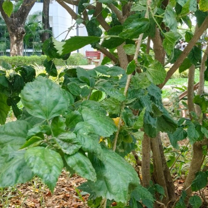
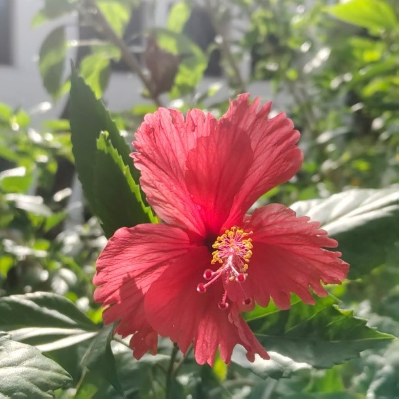

# Tropical Hibiscus / China Rose & Red Hibiscus / Shoeblack Plant (`Hibiscus rosa-sinensis`)

| Field Attribute | Taxonomic / Ecological Specification |
| :--- | :--- |
| **Catalog ID** | `FL-02` |
| **Common Name** | Tropical Hibiscus / China Rose & Red Hibiscus / Shoeblack Plant |
| **Scientific Name** | *Hibiscus rosa-sinensis* |
| **Botanical Family** | `Malvaceae` |
| **Category** | Plant (Evergreen Woody Perennial Shrub) |
| **Location of Observation** | **Pathway behind Dhanyas** |
| **Microhabitat** | Garden hedge / Pathway border |
| **Trophic Level** | Primary Producer (Trophic Level 1) |
| **Deduplication / Survey Source** | Survey Specimens 02 & 12 (Deduplicated single species with documented cultivars) |

---

## Field Observation Photograph

### Observed Color Morphs & Phenotypic Varieties on Campus

#### Tropical Pink / Peach China Rose Morph (Specimen 02)
- **Observation Note**: Ornamental variety supporting butterflies and nectar feeders.
- **Field Image**: `../images/hibiscus_rosa_sinensis_tropical.png`

#### Crimson Red Shoeblack Plant Morph (Specimen 12)
- **Observation Note**: Classic 5-petaled crimson bloom with exerted staminal column.
- **Field Image**: `../images/hibiscus_rosa_sinensis_red.png`

---

## Botanical & Morphological Description

Evergreen flowering shrub with ovate serrated leaves and large solitary 5-petaled flowers with exerted staminal columns. Observed in multiple color cultivars (Tropical China Rose morph and Crimson Red Shoeblack morph) across campus pathways.

---

## Ecological Role & Campus Interactions

- **Trophic Role**: Primary Producer (Autotroph - Trophic Level 1)
- **Ecosystem Service**: Widely planted ornamental shrub supporting local pollinators including butterflies, bees, and nectar-feeding birds (sunbirds). Crimson and multi-colored blooms feature prominent staminal columns.
- **Inter-species Interactions**:
  - Sustains insect pollinators (bees, butterflies, sphinx moths) with nectar and floral resources.
  - Generates structural biomass, microhabitats, and leaf litter for detritivores (millipedes, snails).
  - Provides seeds/drupes and sheltered resting canopy for campus avifauna and primates.

---

[⬅ Back to Flora Index](../README.md) | [🏠 Back to Campus Inventory Root](../../README.md)
