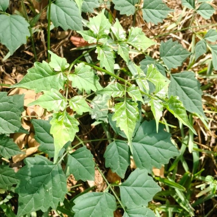

# Peppervine (`Nekemias arborea (syn. Ampelopsis arborea)`)

| Field Attribute | Taxonomic / Ecological Specification |
| :--- | :--- |
| **Catalog ID** | `FL-03` |
| **Common Name** | Peppervine |
| **Scientific Name** | *Nekemias arborea (syn. Ampelopsis arborea)* |
| **Botanical Family** | `Vitaceae` |
| **Category** | Plant (Woody Climbing Vine) |
| **Location of Observation** | **Pathway behind Dhanyas** |
| **Microhabitat** | Climbing vegetation / Ground cover |
| **Trophic Level** | Primary Producer (Trophic Level 1) |
| **Deduplication / Survey Source** | Survey Specimen 03 |

---

## Field Observation Photograph

---

## Botanical & Morphological Description

Perennial deciduous or semi-evergreen woody vine characterized by bipinnately compound leaves with serrated margins. Produces small berry clusters that serve as crucial food for campus avifauna.

---

## Ecological Role & Campus Interactions

- **Trophic Role**: Primary Producer (Autotroph - Trophic Level 1)
- **Ecosystem Service**: Bipinnate vine that acts as ground cover and climbs nearby vegetation, providing shelter for small insects and berries consumed by wild birds.
- **Inter-species Interactions**:
  - Sustains insect pollinators (bees, butterflies, sphinx moths) with nectar and floral resources.
  - Generates structural biomass, microhabitats, and leaf litter for detritivores (millipedes, snails).
  - Provides seeds/drupes and sheltered resting canopy for campus avifauna and primates.

---

[⬅ Back to Flora Index](../README.md) | [🏠 Back to Campus Inventory Root](../../README.md)
