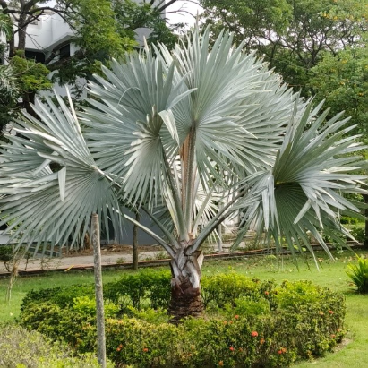

# Bismarck Palm (`Bismarckia nobilis`)

| Field Attribute | Taxonomic / Ecological Specification |
| :--- | :--- |
| **Catalog ID** | `FL-04` |
| **Common Name** | Bismarck Palm |
| **Scientific Name** | *Bismarckia nobilis* |
| **Botanical Family** | `Arecaceae` |
| **Category** | Plant (Solitary Fan Palm / Tree) |
| **Location of Observation** | **Campus entrance** |
| **Microhabitat** | Open landscape / Architectural accent |
| **Trophic Level** | Primary Producer (Trophic Level 1) |
| **Deduplication / Survey Source** | Survey Specimen 04 |

---

## Field Observation Photograph

---

## Botanical & Morphological Description

Noble solitary palm indigenous to Madagascar with a stout trunk topped by a massive spherical crown of steel-blue, costapalmate leaves. Provides elevated perches for predatory and passerine birds.

---

## Ecological Role & Campus Interactions

- **Trophic Role**: Primary Producer (Autotroph - Trophic Level 1)
- **Ecosystem Service**: Distinctive silvery-blue, massive fan-shaped fronds. Serves as an ornamental accent tree and microhabitat for urban birds and insects. Falling leaves add organic biomass to soil.
- **Inter-species Interactions**:
  - Sustains insect pollinators (bees, butterflies, sphinx moths) with nectar and floral resources.
  - Generates structural biomass, microhabitats, and leaf litter for detritivores (millipedes, snails).
  - Provides seeds/drupes and sheltered resting canopy for campus avifauna and primates.

---

[⬅ Back to Flora Index](../README.md) | [🏠 Back to Campus Inventory Root](../../README.md)
