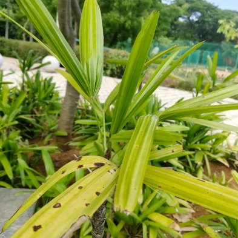

# Bamboo Palm / Lady Palm (`Rhapis excelsa`)

| Field Attribute | Taxonomic / Ecological Specification |
| :--- | :--- |
| **Catalog ID** | `FL-05` |
| **Common Name** | Bamboo Palm / Lady Palm |
| **Scientific Name** | *Rhapis excelsa* |
| **Botanical Family** | `Arecaceae` |
| **Category** | Plant (Clumping Fan Palm / Shrub) |
| **Location of Observation** | **AB3 open space** |
| **Microhabitat** | Shaded understory / Courtyard |
| **Trophic Level** | Primary Producer (Trophic Level 1) |
| **Deduplication / Survey Source** | Survey Specimen 05 |

---

## Field Observation Photograph

---

## Botanical & Morphological Description

Densely clustering fan palm with slender bamboo-like stems covered in coarse brown fiber. The deeply divided palmate leaves create microhabitats for ground invertebrates.

---

## Ecological Role & Campus Interactions

- **Trophic Role**: Primary Producer (Autotroph - Trophic Level 1)
- **Ecosystem Service**: Multi-stemmed, shade-tolerant palm with glossy palmate fronds, commonly cultivated in campus understory landscapes and indoor atriums. Provides dense lower-canopy cover.
- **Inter-species Interactions**:
  - Sustains insect pollinators (bees, butterflies, sphinx moths) with nectar and floral resources.
  - Generates structural biomass, microhabitats, and leaf litter for detritivores (millipedes, snails).
  - Provides seeds/drupes and sheltered resting canopy for campus avifauna and primates.

---

[⬅ Back to Flora Index](../README.md) | [🏠 Back to Campus Inventory Root](../../README.md)
