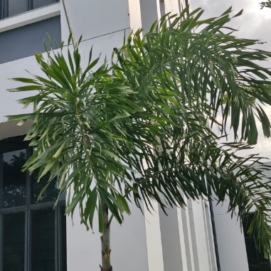

# Sugar Date Palm / Wild Date Palm (`Phoenix sylvestris`)

| Field Attribute | Taxonomic / Ecological Specification |
| :--- | :--- |
| **Catalog ID** | `FL-06` |
| **Common Name** | Sugar Date Palm / Wild Date Palm |
| **Scientific Name** | *Phoenix sylvestris* |
| **Botanical Family** | `Arecaceae` |
| **Category** | Plant (Tree / Arecaceae) |
| **Location of Observation** | **AB3** |
| **Microhabitat** | Open grounds / Semi-arid landscape |
| **Trophic Level** | Primary Producer (Trophic Level 1) |
| **Deduplication / Survey Source** | Survey Specimen 06 |

---

## Field Observation Photograph

---

## Botanical & Morphological Description

Robust native palm reaching up to 15m in height, characterized by diamond-shaped leaf base scars on the trunk. Fruit clusters are vital seasonal food resources for campus wildlife.

---

## Ecological Role & Campus Interactions

- **Trophic Role**: Primary Producer (Autotroph - Trophic Level 1)
- **Ecosystem Service**: Hardy native palm producing dense crowns of spiny pinnate leaves and small edible fruits that feed bats, birds, and bonnet macaques.
- **Inter-species Interactions**:
  - Sustains insect pollinators (bees, butterflies, sphinx moths) with nectar and floral resources.
  - Generates structural biomass, microhabitats, and leaf litter for detritivores (millipedes, snails).
  - Provides seeds/drupes and sheltered resting canopy for campus avifauna and primates.

---

[⬅ Back to Flora Index](../README.md) | [🏠 Back to Campus Inventory Root](../../README.md)
