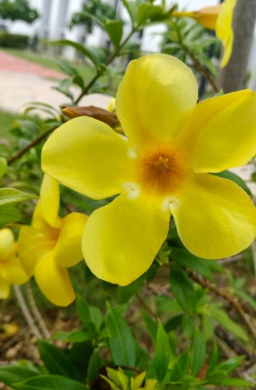

# Golden Trumpet / Yellow Allamanda (`Allamanda cathartica`)

| Field Attribute | Taxonomic / Ecological Specification |
| :--- | :--- |
| **Catalog ID** | `FL-07` |
| **Common Name** | Golden Trumpet / Yellow Allamanda |
| **Scientific Name** | *Allamanda cathartica* |
| **Botanical Family** | `Apocynaceae` |
| **Category** | Plant (Woody Climbing Shrub / Apocynaceae) |
| **Location of Observation** | **AB2** |
| **Microhabitat** | Ornamental garden bed / Wall trellis |
| **Trophic Level** | Primary Producer (Trophic Level 1) |
| **Deduplication / Survey Source** | Survey Specimen 07 |

---

## Field Observation Photograph

---

## Botanical & Morphological Description

Vigorous sprawling evergreen shrub with whorled glossy leathery leaves and trumpet-shaped golden-yellow flowers emitting a delicate fragrance.

---

## Ecological Role & Campus Interactions

- **Trophic Role**: Primary Producer (Autotroph - Trophic Level 1)
- **Ecosystem Service**: Evergreen sprawling shrub with large, vivid yellow funnel-shaped blooms. High ornamental value; supports long-tongued insect pollinators.
- **Inter-species Interactions**:
  - Sustains insect pollinators (bees, butterflies, sphinx moths) with nectar and floral resources.
  - Generates structural biomass, microhabitats, and leaf litter for detritivores (millipedes, snails).
  - Provides seeds/drupes and sheltered resting canopy for campus avifauna and primates.

---

[⬅ Back to Flora Index](../README.md) | [🏠 Back to Campus Inventory Root](../../README.md)
