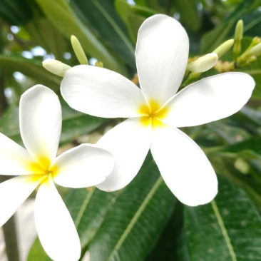

# White Frangipani / Singapore Graveyard Flower (`Plumeria alba`)

| Field Attribute | Taxonomic / Ecological Specification |
| :--- | :--- |
| **Catalog ID** | `FL-09` |
| **Common Name** | White Frangipani / Singapore Graveyard Flower |
| **Scientific Name** | *Plumeria alba* |
| **Botanical Family** | `Apocynaceae` |
| **Category** | Plant (Deciduous Flowering Tree / Apocynaceae) |
| **Location of Observation** | **AB1** |
| **Microhabitat** | Open quadrangle / Building surroundings |
| **Trophic Level** | Primary Producer (Trophic Level 1) |
| **Deduplication / Survey Source** | Survey Specimen 09 |

---

## Field Observation Photograph

---

## Botanical & Morphological Description

Small deciduous tree with narrow elongated lanceolate leaves having distinct downward-curled margins. Flowers release intense fragrance in the evening.

---

## Ecological Role & Campus Interactions

- **Trophic Role**: Primary Producer (Autotroph - Trophic Level 1)
- **Ecosystem Service**: Highly fragrant, five-petaled white flowers with a central yellow throat. Produces milky latex; pollinated primarily by nocturnal sphinx moths.
- **Inter-species Interactions**:
  - Sustains insect pollinators (bees, butterflies, sphinx moths) with nectar and floral resources.
  - Generates structural biomass, microhabitats, and leaf litter for detritivores (millipedes, snails).
  - Provides seeds/drupes and sheltered resting canopy for campus avifauna and primates.

---

[⬅ Back to Flora Index](../README.md) | [🏠 Back to Campus Inventory Root](../../README.md)
