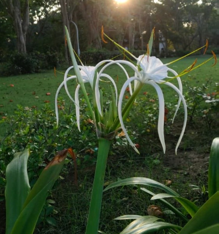

# Beach Spider Lily (`Hymenocallis littoralis (syn. Hymenocallis speciosa)`)

| Field Attribute | Taxonomic / Ecological Specification |
| :--- | :--- |
| **Catalog ID** | `FL-11` |
| **Common Name** | Beach Spider Lily |
| **Scientific Name** | *Hymenocallis littoralis (syn. Hymenocallis speciosa)* |
| **Botanical Family** | `Amaryllidaceae` |
| **Category** | Plant (Bulbous Perennial Herb / Amaryllidaceae) |
| **Location of Observation** | **Pathway behind Dhanyas** |
| **Microhabitat** | Moist soil border / Drainage margin |
| **Trophic Level** | Primary Producer (Trophic Level 1) |
| **Deduplication / Survey Source** | Survey Specimen 11 |

---

## Field Observation Photograph

---

## Botanical & Morphological Description

Bulbous perennial herb with strap-like linear leaves and umbels of pure white spider-like blossoms. Roots stabilize soil along moist drainage contours.

---

## Ecological Role & Campus Interactions

- **Trophic Role**: Primary Producer (Autotroph - Trophic Level 1)
- **Ecosystem Service**: Features elegant white star-shaped flowers with delicate spider-like petals radiating from a central cup. Thrives in moist soils and filters runoff water.
- **Inter-species Interactions**:
  - Sustains insect pollinators (bees, butterflies, sphinx moths) with nectar and floral resources.
  - Generates structural biomass, microhabitats, and leaf litter for detritivores (millipedes, snails).
  - Provides seeds/drupes and sheltered resting canopy for campus avifauna and primates.

---

[⬅ Back to Flora Index](../README.md) | [🏠 Back to Campus Inventory Root](../../README.md)
