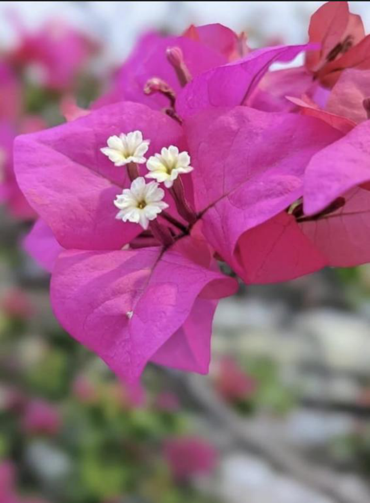

# Paper Flower / Bougainvillea (`Bougainvillea glabra`)

| Field Attribute | Taxonomic / Ecological Specification |
| :--- | :--- |
| **Catalog ID** | `FL-12` |
| **Common Name** | Paper Flower / Bougainvillea |
| **Scientific Name** | *Bougainvillea glabra* |
| **Botanical Family** | `Nyctaginaceae` |
| **Category** | Plant (Ornamental Woody Climber / Shrub) |
| **Location of Observation** | **Ornamental garden beside fountain** |
| **Microhabitat** | Trained on pergola / Garden trellis |
| **Trophic Level** | Primary Producer (Trophic Level 1) |
| **Contributing Survey Team** | **Team Katyayani** |
| **Survey Source** | Assignment 2 Survey (Team Katyayani) |

---

## Field Observation Photograph

---

## Botanical & Morphological Description

Vigorous thorny evergreen shrub or woody climber featuring showy, paper-thin magenta bracts. Bracts shield delicate cream-white floral tubes adapted for pollinator visits.

---

## Ecological Role & Campus Interactions

- **Trophic Role**: Primary Producer (Trophic Level 1)
- **Ecosystem Service**: Drought-tolerant climbing woody shrub with vibrant magenta-pink petaloid bracts enclosing small tubular flowers. Provides dense nesting foliage for birds and abundant nectar for long-tongued butterflies and bees.
- **Inter-species Interactions**:
  - Provides vital floral rewards (nectar, pollen) or structural microhabitats for campus biodiversity.
  - Supports pollinators (butterflies, bees, flower-visitors) and detritivore nutrient recycling.
  - Form an integral component of the campus green spaces.

---

[⬅ Back to Flora Index](../README.md) | [🏠 Back to Campus Inventory Root](../../README.md)
