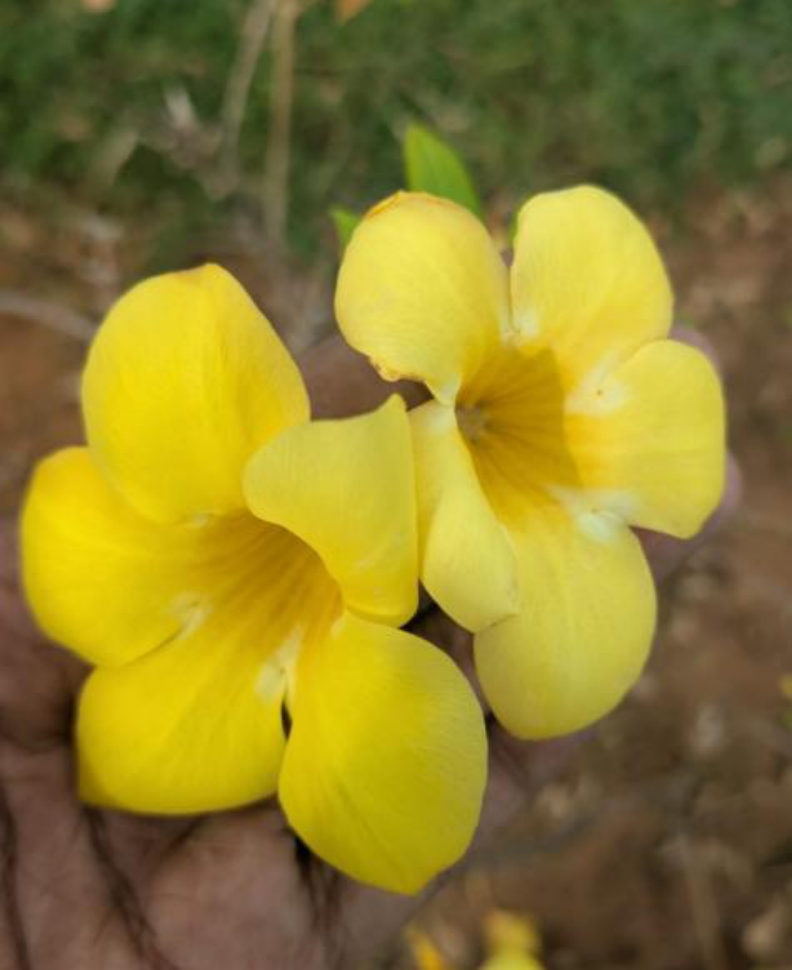

# Pink Knotweed / Denseflower Knotweed (`Persicaria barbata`)

| Field Attribute | Taxonomic / Ecological Specification |
| :--- | :--- |
| **Catalog ID** | `FL-13` |
| **Common Name** | Pink Knotweed / Denseflower Knotweed |
| **Scientific Name** | *Persicaria barbata* |
| **Botanical Family** | `Polygonaceae` |
| **Category** | Plant (Erect Herb / Wetland Emergent) |
| **Location of Observation** | **Snowcube** |
| **Microhabitat** | Moist soil / Grassy open ground |
| **Trophic Level** | Primary Producer (Trophic Level 1) |
| **Contributing Survey Team** | **Team Katyayani** |
| **Survey Source** | Assignment 2 Survey (Team Katyayani) |

---

## Field Observation Photograph

---

## Botanical & Morphological Description

Herbaceous plant characterized by lanceolate leaves with ciliate ocreae and dense spicate racemes of pinkish-white flowers. Thrives in localized damp spots near open campus lawns.

---

## Ecological Role & Campus Interactions

- **Trophic Role**: Primary Producer (Trophic Level 1)
- **Ecosystem Service**: Moisture-loving perennial herb producing slender spikes of delicate pink flowers. Helps stabilize moist soil and provides nectar to campus micro-pollinators.
- **Inter-species Interactions**:
  - Provides vital floral rewards (nectar, pollen) or structural microhabitats for campus biodiversity.
  - Supports pollinators (butterflies, bees, flower-visitors) and detritivore nutrient recycling.
  - Form an integral component of the campus green spaces.

---

[⬅ Back to Flora Index](../README.md) | [🏠 Back to Campus Inventory Root](../../README.md)
