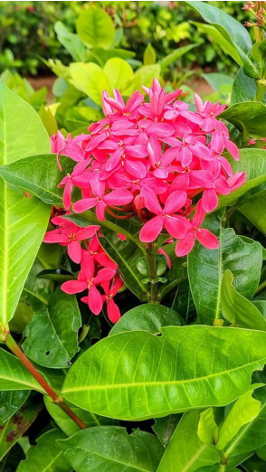

# Scarlet & Pink Ixora / Jungle Geranium (`Ixora coccinea`)

| Field Attribute | Taxonomic / Ecological Specification |
| :--- | :--- |
| **Catalog ID** | `FL-14` |
| **Common Name** | Scarlet & Pink Ixora / Jungle Geranium |
| **Scientific Name** | *Ixora coccinea* |
| **Botanical Family** | `Rubiaceae` |
| **Category** | Plant (Evergreen Ornamental Shrub) |
| **Location of Observation** | **Central plaza beds, SSN Admin Block Road** |
| **Microhabitat** | Clipped hedge, full sun to partial shade |
| **Trophic Level** | Primary Producer (Trophic Level 1) |
| **Contributing Survey Team** | **Team Prathin** |
| **Survey Source** | Assignment 2 Survey (Team Prathin) |

---

## Field Observation Photograph

---

## Botanical & Morphological Description

Dense flowering shrub with opposite, glossy leathery oblong leaves and terminal clusters of four-petaled scarlet or salmon-pink tubular flowers. Extensively cultivated as attractive boundary hedges.

---

## Ecological Role & Campus Interactions

- **Trophic Role**: Primary Producer (Trophic Level 1)
- **Ecosystem Service**: Compact evergreen shrub with dense corymbs of scarlet-red and pink tubular flowers. Long corolla tubes provide critical nectar resources for long-tongued butterflies, sunbirds, and honeybees.
- **Inter-species Interactions**:
  - Provides vital floral rewards (nectar, pollen) or structural microhabitats for campus biodiversity.
  - Supports pollinators (butterflies, bees, flower-visitors) and detritivore nutrient recycling.
  - Form an integral component of the campus green spaces.

---

[⬅ Back to Flora Index](../README.md) | [🏠 Back to Campus Inventory Root](../../README.md)
