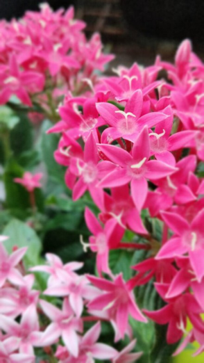

# Egyptian Starcluster (`Pentas lanceolata`)

| Field Attribute | Taxonomic / Ecological Specification |
| :--- | :--- |
| **Catalog ID** | `FL-15` |
| **Common Name** | Egyptian Starcluster |
| **Scientific Name** | *Pentas lanceolata* |
| **Botanical Family** | `Rubiaceae` |
| **Category** | Plant (Perennial Flowering Herb / Subshrub) |
| **Location of Observation** | **Chemical Engineering block frontage** |
| **Microhabitat** | Potted planters, maintained ornamental beds |
| **Trophic Level** | Primary Producer (Trophic Level 1) |
| **Contributing Survey Team** | **Team Prathin** |
| **Survey Source** | Assignment 2 Survey (Team Prathin) |

---

## Field Observation Photograph

---

## Botanical & Morphological Description

Erect perennial with lanceolate veined leaves and terminal umbel-like cymes packed with star-shaped tubular flowers. Highly prized in campus pollinator gardens.

---

## Ecological Role & Campus Interactions

- **Trophic Role**: Primary Producer (Trophic Level 1)
- **Ecosystem Service**: Continuously blooming nectar plant bearing corymbs of 5-pointed star-shaped pink/magenta flowers. Consistently recorded as the most visited nectar source for butterflies and native bees on campus.
- **Inter-species Interactions**:
  - Provides vital floral rewards (nectar, pollen) or structural microhabitats for campus biodiversity.
  - Supports pollinators (butterflies, bees, flower-visitors) and detritivore nutrient recycling.
  - Form an integral component of the campus green spaces.

---

[⬅ Back to Flora Index](../README.md) | [🏠 Back to Campus Inventory Root](../../README.md)
