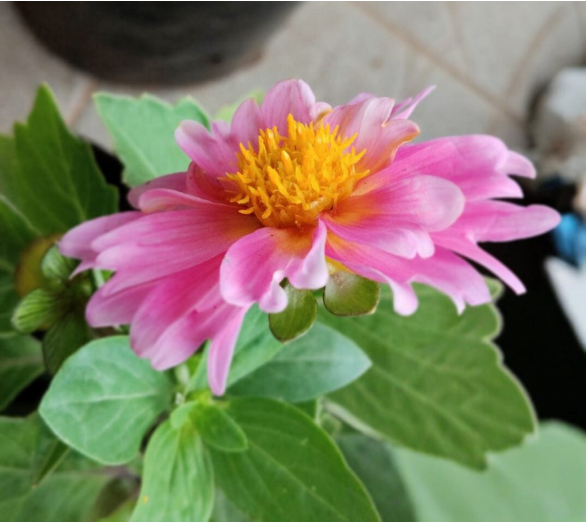

# Common Zinnia (`Zinnia elegans`)

| Field Attribute | Taxonomic / Ecological Specification |
| :--- | :--- |
| **Catalog ID** | `FL-16` |
| **Common Name** | Common Zinnia |
| **Scientific Name** | *Zinnia elegans* |
| **Botanical Family** | `Asteraceae` |
| **Category** | Plant (Annual Flowering Herb) |
| **Location of Observation** | **Central plaza beds, SSN Admin Block Road** |
| **Microhabitat** | Container soil & open garden beds, full sun |
| **Trophic Level** | Primary Producer (Trophic Level 1) |
| **Contributing Survey Team** | **Team Prathin** |
| **Survey Source** | Assignment 2 Survey (Team Prathin) |

---

## Field Observation Photograph

---

## Botanical & Morphological Description

Stiff, erect annual herb with opposite sessile leaves and solitary composite flower heads. Central disc florets provide accessible pollen rewards.

---

## Ecological Role & Campus Interactions

- **Trophic Role**: Primary Producer (Trophic Level 1)
- **Ecosystem Service**: Sun-loving composite flower with exposed central disc florets and bright pink/crimson ray petals. Easily accessible nectar and pollen sustain native bees, syrphid flies, and butterflies.
- **Inter-species Interactions**:
  - Provides vital floral rewards (nectar, pollen) or structural microhabitats for campus biodiversity.
  - Supports pollinators (butterflies, bees, flower-visitors) and detritivore nutrient recycling.
  - Form an integral component of the campus green spaces.

---

[Back to Flora Index](../README.md) | [Back to Campus Inventory Root](../../README.md)
