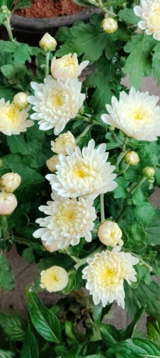

# Florist's Chrysanthemum (`Chrysanthemum morifolium`)

| Field Attribute | Taxonomic / Ecological Specification |
| :--- | :--- |
| **Catalog ID** | `FL-17` |
| **Common Name** | Florist's Chrysanthemum |
| **Scientific Name** | *Chrysanthemum morifolium* |
| **Botanical Family** | `Asteraceae` |
| **Category** | Plant (Perennial Herb / Asteraceae) |
| **Location of Observation** | **Hostel garden pots, Gents Hostel Road** |
| **Microhabitat** | Potted cultivation, partial shade |
| **Trophic Level** | Primary Producer (Trophic Level 1) |
| **Contributing Survey Team** | **Team Prathin** |
| **Survey Source** | Assignment 2 Survey (Team Prathin) |

---

## Field Observation Photograph

---

## Botanical & Morphological Description

Bushy perennial with lobed aromatic foliage and pompon-like multi-petaled double floral heads. Densely packed ray florets offer structural microclimate in patio pots.

---

## Ecological Role & Campus Interactions

- **Trophic Role**: Primary Producer (Trophic Level 1)
- **Ecosystem Service**: Ornamental potted cultivar bearing multi-layered white-and-yellow double flower heads. Cultivated for student residence aesthetics.
- **Inter-species Interactions**:
  - Provides vital floral rewards (nectar, pollen) or structural microhabitats for campus biodiversity.
  - Supports pollinators (butterflies, bees, flower-visitors) and detritivore nutrient recycling.
  - Form an integral component of the campus green spaces.

---

[Back to Flora Index](../README.md) | [Back to Campus Inventory Root](../../README.md)
