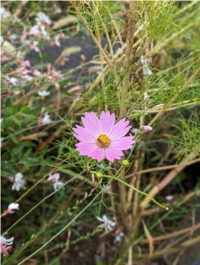

# Garden Cosmos / Mexican Aster (`Cosmos bipinnatus`)

| Field Attribute | Taxonomic / Ecological Specification |
| :--- | :--- |
| **Catalog ID** | `FL-18` |
| **Common Name** | Garden Cosmos / Mexican Aster |
| **Scientific Name** | *Cosmos bipinnatus* |
| **Botanical Family** | `Asteraceae` |
| **Category** | Plant (Self-seeding Herb / Asteraceae) |
| **Location of Observation** | **Central plaza beds, SSN Admin Block Road** |
| **Microhabitat** | Rough grassy margins beside maintained beds |
| **Trophic Level** | Primary Producer (Trophic Level 1) |
| **Contributing Survey Team** | **Team Prathin** |
| **Survey Source** | Assignment 2 Survey (Team Prathin) |

---

## Field Observation Photograph

---

## Botanical & Morphological Description

Slender herbaceous annual with deeply divided pinnatisect leaves and terminal flower heads with delicate fluted ray petals radiating from a sunny yellow center.

---

## Ecological Role & Campus Interactions

- **Trophic Role**: Primary Producer (Trophic Level 1)
- **Ecosystem Service**: Feathery-foliaged annual herb with saucer-like lilac-pink ray florets surrounding a yellow disc. Readily self-seeds in open grassy verge habitats and attracts beneficial pollinators.
- **Inter-species Interactions**:
  - Provides vital floral rewards (nectar, pollen) or structural microhabitats for campus biodiversity.
  - Supports pollinators (butterflies, bees, flower-visitors) and detritivore nutrient recycling.
  - Form an integral component of the campus green spaces.

---

[⬅ Back to Flora Index](../README.md) | [🏠 Back to Campus Inventory Root](../../README.md)
