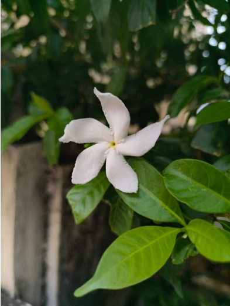

# Crepe Jasmine / Pinwheel Flower (`Tabernaemontana divaricata`)

| Field Attribute | Taxonomic / Ecological Specification |
| :--- | :--- |
| **Catalog ID** | `FL-19` |
| **Common Name** | Crepe Jasmine / Pinwheel Flower |
| **Scientific Name** | *Tabernaemontana divaricata* |
| **Botanical Family** | `Apocynaceae` |
| **Category** | Plant (Evergreen Shrub / Apocynaceae) |
| **Location of Observation** | **Central plaza beds, SSN Admin Block Road** |
| **Microhabitat** | Shaded shrub beds beside paving |
| **Trophic Level** | Primary Producer (Trophic Level 1) |
| **Contributing Survey Team** | **Team Prathin** |
| **Survey Source** | Assignment 2 Survey (Team Prathin) |

---

## Field Observation Photograph

---

## Botanical & Morphological Description

Glossy-leaved dichotomously branched evergreen shrub with milky sap and snow-white 5-petaled pinwheel flowers arranged in small cymes.

---

## Ecological Role & Campus Interactions

- **Trophic Role**: Primary Producer (Trophic Level 1)
- **Ecosystem Service**: Evergreen shrub bearing waxy pinwheel-shaped white flowers emitting a delicate fragrance at dusk. Sustains nocturnal moths and diurnal micro-insects.
- **Inter-species Interactions**:
  - Provides vital floral rewards (nectar, pollen) or structural microhabitats for campus biodiversity.
  - Supports pollinators (butterflies, bees, flower-visitors) and detritivore nutrient recycling.
  - Form an integral component of the campus green spaces.

---

[Back to Flora Index](../README.md) | [Back to Campus Inventory Root](../../README.md)
