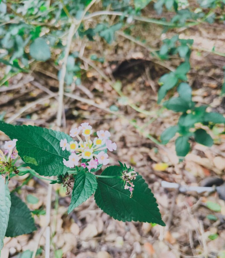

# Common Lantana / Wild Sage (`Lantana camara`)

| Field Attribute | Taxonomic / Ecological Specification |
| :--- | :--- |
| **Catalog ID** | `FL-20` |
| **Common Name** | Common Lantana / Wild Sage |
| **Scientific Name** | *Lantana camara* |
| **Botanical Family** | `Verbenaceae` |
| **Category** | Plant (Sprawling Shrub / Naturalised) |
| **Location of Observation** | **Rough ground beside Bio-Medical Engineering block** |
| **Microhabitat** | Disturbed open soil, roadside wasteland & leaf litter |
| **Trophic Level** | Primary Producer (Trophic Level 1) |
| **Contributing Survey Team** | **Team Prathin** |
| **Survey Source** | Assignment 2 Survey (Team Prathin) |

---

## Field Observation Photograph

---

## Botanical & Morphological Description

Perennial woody shrub with ovate scabrous leaves with toothed margins and compact umbilical head of tubular flowers in contrasting colors. Produces small dark drupes.

---

## Ecological Role & Campus Interactions

- **Trophic Role**: Primary Producer (Trophic Level 1)
- **Ecosystem Service**: Hardy, multi-colored flowering shrub with inflorescences shifting from yellow to pink to orange. While ecologically invasive in forests, campus bushes act as an indispensable nectar magnet for butterflies.
- **Inter-species Interactions**:
  - Provides vital floral rewards (nectar, pollen) or structural microhabitats for campus biodiversity.
  - Supports pollinators (butterflies, bees, flower-visitors) and detritivore nutrient recycling.
  - Form an integral component of the campus green spaces.

---

[Back to Flora Index](../README.md) | [Back to Campus Inventory Root](../../README.md)
