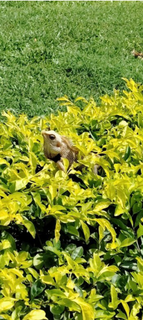

# Bermuda Grass / Arugampullu (`Cynodon dactylon`)

| Field Attribute | Taxonomic / Ecological Specification |
| :--- | :--- |
| **Catalog ID** | `FL-22` |
| **Common Name** | Bermuda Grass / Arugampullu |
| **Scientific Name** | *Cynodon dactylon* |
| **Botanical Family** | `Poaceae` |
| **Category** | Plant (Perennial Turf Grass) |
| **Location of Observation** | **All mown lawns across campus** |
| **Microhabitat** | Mown turf, open sun, sports fields |
| **Trophic Level** | Primary Producer (Trophic Level 1) |
| **Contributing Survey Team** | **Team Prathin** |
| **Survey Source** | Assignment 2 Survey (Team Prathin) |

---

## Field Observation Photograph

---

## Botanical & Morphological Description

Hardy prostrate grass with extensive rhizomes and stolons, greyish-green blades, and terminal digitately arranged flower spikes.

---

## Ecological Role & Campus Interactions

- **Trophic Role**: Primary Producer (Trophic Level 1)
- **Ecosystem Service**: Stoloniferous mat-forming perennial grass that stabilizes campus topsoil, resists foot traffic, and provides primary forage for herbivorous grasshoppers, seed bugs, and peafowl.
- **Inter-species Interactions**:
  - Provides vital floral rewards (nectar, pollen) or structural microhabitats for campus biodiversity.
  - Supports pollinators (butterflies, bees, flower-visitors) and detritivore nutrient recycling.
  - Form an integral component of the campus green spaces.

---

[Back to Flora Index](../README.md) | [Back to Campus Inventory Root](../../README.md)
