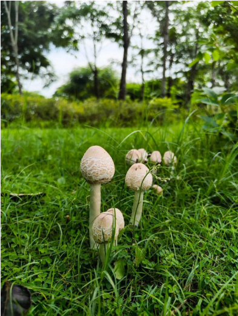

# Parasol Mushroom / Lawn Chlorophyllum (`Chlorophyllum sp.`)

| Field Attribute | Taxonomic / Ecological Specification |
| :--- | :--- |
| **Catalog ID** | `FL-23` |
| **Common Name** | Parasol Mushroom / Lawn Chlorophyllum |
| **Scientific Name** | *Chlorophyllum sp.* |
| **Botanical Family** | `Agaricaceae` |
| **Category** | Fungi (Saprotrophic Agaric) |
| **Location of Observation** | **Lawn beside the Sports Complex** |
| **Microhabitat** | Damp mown turf following monsoon rains |
| **Trophic Level** | Decomposer / Saprotroph (Trophic Level 1-2) |
| **Contributing Survey Team** | **Team Prathin** |
| **Survey Source** | Assignment 2 Survey (Team Prathin) |

---

## Field Observation Photograph

---

## Botanical & Morphological Description

Fruiting mushroom with a tall stalk and a broad convex cap covered in concentric brownish scales on a pale background. Appears gregariously in open lawns after heavy rainfall.

---

## Ecological Role & Campus Interactions

- **Trophic Role**: Decomposer / Saprotroph (Trophic Level 1-2)
- **Ecosystem Service**: Saprotrophic macrofungus whose subterranean mycelial network rapidly breaks down dead lawn grass roots and organic clippings, unlocking mineral nutrients back to the soil.
- **Inter-species Interactions**:
  - Provides vital floral rewards (nectar, pollen) or structural microhabitats for campus biodiversity.
  - Supports pollinators (butterflies, bees, flower-visitors) and detritivore nutrient recycling.
  - Form an integral component of the campus green spaces.

---

[Back to Flora Index](../README.md) | [Back to Campus Inventory Root](../../README.md)
