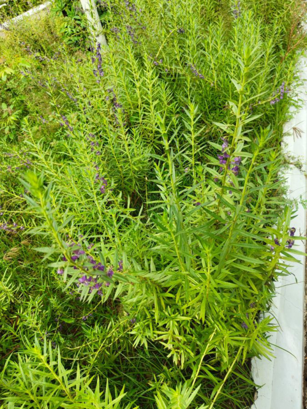

# Willowleaf Angelon / Summer Snapdragon (`Angelonia salicariifolia`)

| Field Attribute | Taxonomic / Ecological Specification |
| :--- | :--- |
| **Catalog ID** | `FL-24` |
| **Common Name** | Willowleaf Angelon / Summer Snapdragon |
| **Scientific Name** | *Angelonia salicariifolia* |
| **Botanical Family** | `Plantaginaceae` |
| **Category** | Plant (Perennial Herb / Plantaginaceae) |
| **Location of Observation** | **Near Clocktower** |
| **Microhabitat** | Naturalised herb in cultivated garden borders |
| **Trophic Level** | Primary Producer (Trophic Level 1) |
| **Contributing Survey Team** | **Team Viswa** |
| **Survey Source** | Assignment 2 Survey (Team Viswa) |

---

## Field Observation Photograph

---

## Botanical & Morphological Description

Bushy erect herb with narrow willow-like serrated leaves and terminal spikes crowded with purple snapdragon-like flowers emitting an apple-like scent.

---

## Ecological Role & Campus Interactions

- **Trophic Role**: Primary Producer (Trophic Level 1)
- **Ecosystem Service**: Hardy perennial herb producing dense upright spikes of two-lipped violet-purple flowers with specialized floral oil glands that attract solitary pollinating bees.
- **Inter-species Interactions**:
  - Provides vital floral rewards (nectar, pollen) or structural microhabitats for campus biodiversity.
  - Supports pollinators (butterflies, bees, flower-visitors) and detritivore nutrient recycling.
  - Form an integral component of the campus green spaces.

---

[Back to Flora Index](../README.md) | [Back to Campus Inventory Root](../../README.md)
