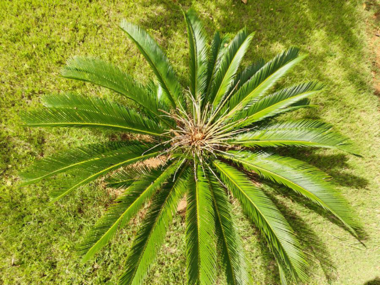

# Sago Palm / King Sago Cycad (`Cycas revoluta`)

| Field Attribute | Taxonomic / Ecological Specification |
| :--- | :--- |
| **Catalog ID** | `FL-25` |
| **Common Name** | Sago Palm / King Sago Cycad |
| **Scientific Name** | *Cycas revoluta* |
| **Botanical Family** | `Cycadaceae` |
| **Category** | Plant (Gymnosperm / Ancient Cycad) |
| **Location of Observation** | **Garden Lawn near AB1** |
| **Microhabitat** | Ornamental lawn planting, full sun to partial shade |
| **Trophic Level** | Primary Producer (Trophic Level 1) |
| **Contributing Survey Team** | **Team Rehan** |
| **Survey Source** | Assignment 2 Survey (Team Rehan) |

---

## Field Observation Photograph

---

## Botanical & Morphological Description

Slow-growing palm-like cycad featuring a thick shaggy trunk topped by a symmetrical rosette of stiff, glossy dark green pinnate leaves with revolute margins.

---

## Ecological Role & Campus Interactions

- **Trophic Role**: Primary Producer (Trophic Level 1)
- **Ecosystem Service**: Ancient gymnosperm dating back to the Mesozoic era, possessing nitrogen-fixing coralloid roots with symbiotic cyanobacteria. Provides high architectural landscape value.
- **Inter-species Interactions**:
  - Provides vital floral rewards (nectar, pollen) or structural microhabitats for campus biodiversity.
  - Supports pollinators (butterflies, bees, flower-visitors) and detritivore nutrient recycling.
  - Form an integral component of the campus green spaces.

---

[⬅ Back to Flora Index](../README.md) | [🏠 Back to Campus Inventory Root](../../README.md)
