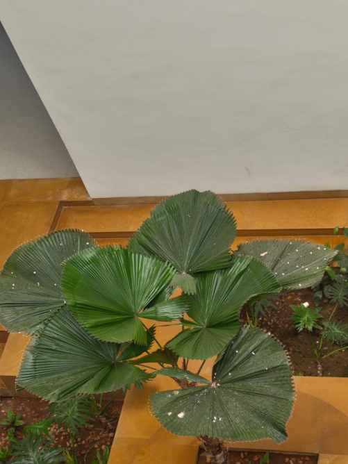

# Ruffled Fan Palm / Vanuatu Fan Palm (`Licuala grandis`)

| Field Attribute | Taxonomic / Ecological Specification |
| :--- | :--- |
| **Catalog ID** | `FL-26` |
| **Common Name** | Ruffled Fan Palm / Vanuatu Fan Palm |
| **Scientific Name** | *Licuala grandis* |
| **Botanical Family** | `Arecaceae` |
| **Category** | Plant (Solitary Fan Palm / Arecaceae) |
| **Location of Observation** | **AB1 Entrance** |
| **Microhabitat** | Shaded indoor-outdoor courtyard planting |
| **Trophic Level** | Primary Producer (Trophic Level 1) |
| **Contributing Survey Team** | **Team Viswa** |
| **Survey Source** | Assignment 2 Survey (Team Viswa) |

---

## Field Observation Photograph

---

## Botanical & Morphological Description

Stunning small solitary palm with erect slender trunk and large, undivided orbicular fan-shaped leaves with deeply pleated, notched margins.

---

## Ecological Role & Campus Interactions

- **Trophic Role**: Primary Producer (Trophic Level 1)
- **Ecosystem Service**: Understory palm prized for magnificent undivided pleated circular fronds that channel rainwater down petioles to root zones.
- **Inter-species Interactions**:
  - Provides vital floral rewards (nectar, pollen) or structural microhabitats for campus biodiversity.
  - Supports pollinators (butterflies, bees, flower-visitors) and detritivore nutrient recycling.
  - Form an integral component of the campus green spaces.

---

[Back to Flora Index](../README.md) | [Back to Campus Inventory Root](../../README.md)
