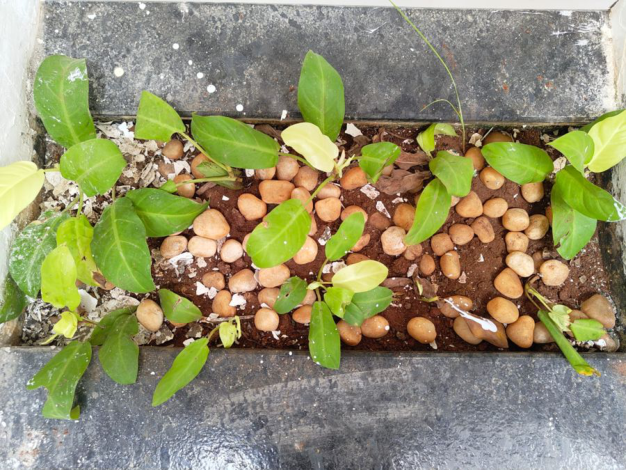

# Golden Melinonii (`Philodendron melinonii 'Golden'`)

| Field Attribute | Taxonomic / Ecological Specification |
| :--- | :--- |
| **Catalog ID** | `FL-27` |
| **Common Name** | Golden Melinonii |
| **Scientific Name** | *Philodendron melinonii 'Golden'* |
| **Botanical Family** | `Araceae` |
| **Category** | Plant (Epiphytic / Potted Aroid) |
| **Location of Observation** | **AB1 Golden Stairs** |
| **Microhabitat** | Shaded, moist gravel/soil planter |
| **Trophic Level** | Primary Producer (Trophic Level 1) |
| **Contributing Survey Team** | **Team Rehan** |
| **Survey Source** | Assignment 2 Survey (Team Rehan) |

---

## Field Observation Photograph

---

## Botanical & Morphological Description

Stout rosette-forming tropical aroid displaying luminous chartreuse-gold ovate leaves supported by robust succulent orange-tinted petioles.

---

## Ecological Role & Campus Interactions

- **Trophic Role**: Primary Producer (Trophic Level 1)
- **Ecosystem Service**: Vibrant yellow-green architectural aroid capable of absorbing indoor atmospheric pollutants and thriving in low-light shaded planters.
- **Inter-species Interactions**:
  - Provides vital floral rewards (nectar, pollen) or structural microhabitats for campus biodiversity.
  - Supports pollinators (butterflies, bees, flower-visitors) and detritivore nutrient recycling.
  - Form an integral component of the campus green spaces.

---

[⬅ Back to Flora Index](../README.md) | [🏠 Back to Campus Inventory Root](../../README.md)
