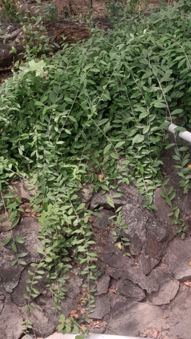

# Wild Jasmine / Ban Mallika (`Jasminum angustifolium`)

| Field Attribute | Taxonomic / Ecological Specification |
| :--- | :--- |
| **Catalog ID** | `FL-28` |
| **Common Name** | Wild Jasmine / Ban Mallika |
| **Scientific Name** | *Jasminum angustifolium* |
| **Botanical Family** | `Oleaceae` |
| **Category** | Plant (Woody Climbing Vine) |
| **Location of Observation** | **Near AB3** |
| **Microhabitat** | Trailing over rocks and roadside embankments |
| **Trophic Level** | Primary Producer (Trophic Level 1) |
| **Contributing Survey Team** | **Team Viswa** |
| **Survey Source** | Assignment 2 Survey (Team Viswa) |

---

## Field Observation Photograph

---

## Botanical & Morphological Description

Slender climbing or scrambling shrub with small opposite ovate-lanceolate glossy leaves and solitary or clustered sweet-scented white starry flowers.

---

## Ecological Role & Campus Interactions

- **Trophic Role**: Primary Producer (Trophic Level 1)
- **Ecosystem Service**: Native drought-hardy climber with fragrant star-shaped white flowers that attract nocturnal hawkmoths and diurnal butterflies. Foliage binds embankment rocks.
- **Inter-species Interactions**:
  - Provides vital floral rewards (nectar, pollen) or structural microhabitats for campus biodiversity.
  - Supports pollinators (butterflies, bees, flower-visitors) and detritivore nutrient recycling.
  - Form an integral component of the campus green spaces.

---

[Back to Flora Index](../README.md) | [Back to Campus Inventory Root](../../README.md)
