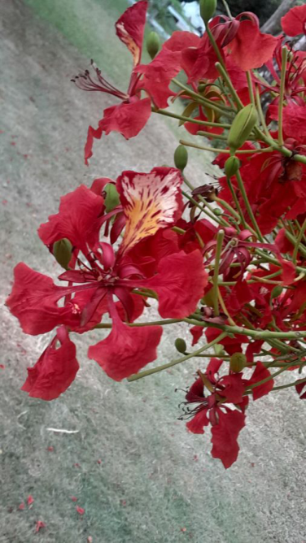

# Gulmohar / Royal Poinciana (Flame Tree) (`Delonix regia`)

| Field Attribute | Taxonomic / Ecological Specification |
| :--- | :--- |
| **Catalog ID** | `FL-29` |
| **Common Name** | Gulmohar / Royal Poinciana (Flame Tree) |
| **Scientific Name** | *Delonix regia* |
| **Botanical Family** | `Fabaceae` |
| **Category** | Plant (Large Deciduous Canopy Tree) |
| **Location of Observation** | **Clocktower** |
| **Microhabitat** | Large flowering avenue and shade tree |
| **Trophic Level** | Primary Producer (Trophic Level 1) |
| **Contributing Survey Team** | **Team Rehan** |
| **Survey Source** | Assignment 2 Survey (Team Rehan) |

---

## Field Observation Photograph

---

## Botanical & Morphological Description

Magnificent broad-crowned tree producing sensational clusters of 4 spreading scarlet petals and a fifth upright variegated yellow/white standard petal.

---

## Ecological Role & Campus Interactions

- **Trophic Role**: Primary Producer (Trophic Level 1)
- **Ecosystem Service**: Spreading umbrella-canopy tree with feathery bipinnate leaves and fiery scarlet blooms. Major shade provider, microclimate moderator, and avian nesting canopy.
- **Inter-species Interactions**:
  - Provides vital floral rewards (nectar, pollen) or structural microhabitats for campus biodiversity.
  - Supports pollinators (butterflies, bees, flower-visitors) and detritivore nutrient recycling.
  - Form an integral component of the campus green spaces.

---

[⬅ Back to Flora Index](../README.md) | [🏠 Back to Campus Inventory Root](../../README.md)
