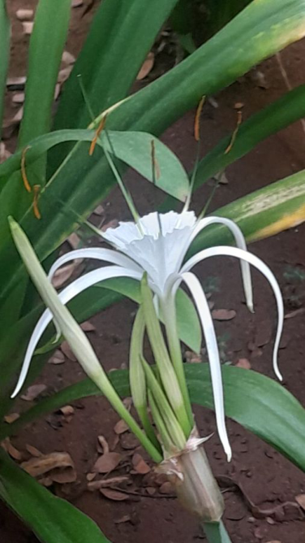

# Giant Crinum Lily / Poison Bulb (`Crinum asiaticum`)

| Field Attribute | Taxonomic / Ecological Specification |
| :--- | :--- |
| **Catalog ID** | `FL-30` |
| **Common Name** | Giant Crinum Lily / Poison Bulb |
| **Scientific Name** | *Crinum asiaticum* |
| **Botanical Family** | `Amaryllidaceae` |
| **Category** | Plant (Robust Bulbous Perennial Herb) |
| **Location of Observation** | **Near Old Sports Complex** |
| **Microhabitat** | Moist garden bed & landscaped lawn contours |
| **Trophic Level** | Primary Producer (Trophic Level 1) |
| **Contributing Survey Team** | **Team Viswa** |
| **Survey Source** | Assignment 2 Survey (Team Viswa) |

---

## Field Observation Photograph

---

## Botanical & Morphological Description

Massive perennial herb with thick false stems, broad strap-like fleshy leaves, and an elevated umbel of tubular pure white flowers with thread-like recurved petals.

---

## Ecological Role & Campus Interactions

- **Trophic Role**: Primary Producer (Trophic Level 1)
- **Ecosystem Service**: Large bulbous plant bearing fragrant white spidery flowers with reddish-purple filaments. Attracts night-flying sphinx moths; roots bind loose sandy-loam soils.
- **Inter-species Interactions**:
  - Provides vital floral rewards (nectar, pollen) or structural microhabitats for campus biodiversity.
  - Supports pollinators (butterflies, bees, flower-visitors) and detritivore nutrient recycling.
  - Form an integral component of the campus green spaces.

---

[Back to Flora Index](../README.md) | [Back to Campus Inventory Root](../../README.md)
