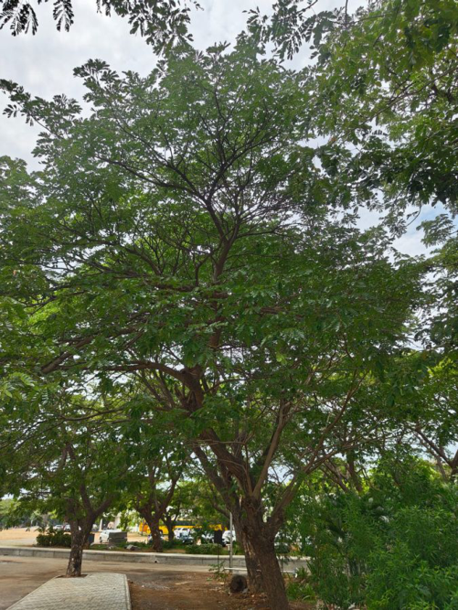

# East Indian Walnut / Siris Tree (`Albizia lebbeck`)

| Field Attribute | Taxonomic / Ecological Specification |
| :--- | :--- |
| **Catalog ID** | `FL-31` |
| **Common Name** | East Indian Walnut / Siris Tree |
| **Scientific Name** | *Albizia lebbeck* |
| **Botanical Family** | `Fabaceae` |
| **Category** | Plant (Deciduous Timber / Shade Tree) |
| **Location of Observation** | **Pathway near Old Sports Complex** |
| **Microhabitat** | Large shade tree in open lawn campus groves |
| **Trophic Level** | Primary Producer (Trophic Level 1) |
| **Contributing Survey Team** | **Team Viswa** |
| **Survey Source** | Assignment 2 Survey (Team Viswa) |

---

## Field Observation Photograph

---

## Botanical & Morphological Description

Large spreading tree with bipinnate leaves, mimosa-like fragrant pompon flowers with long exerted stamens, and conspicuous flat papery seed pods ('Woman's tongue tree').

---

## Ecological Role & Campus Interactions

- **Trophic Role**: Primary Producer (Trophic Level 1)
- **Ecosystem Service**: Native nitrogen-fixing leguminous tree with fragrant puff-like greenish-yellow pompon blossoms and rattling straw-colored seed pods. Major nesting site for babblers and coucals.
- **Inter-species Interactions**:
  - Provides vital floral rewards (nectar, pollen) or structural microhabitats for campus biodiversity.
  - Supports pollinators (butterflies, bees, flower-visitors) and detritivore nutrient recycling.
  - Form an integral component of the campus green spaces.

---

[Back to Flora Index](../README.md) | [Back to Campus Inventory Root](../../README.md)
