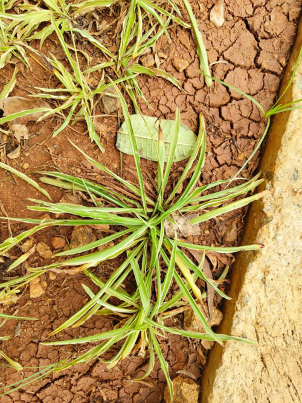

# Variegated Spider Plant / Ribbon Plant (`Chlorophytum comosum 'Variegatum'`)

| Field Attribute | Taxonomic / Ecological Specification |
| :--- | :--- |
| **Catalog ID** | `FL-32` |
| **Common Name** | Variegated Spider Plant / Ribbon Plant |
| **Scientific Name** | *Chlorophytum comosum 'Variegatum'* |
| **Botanical Family** | `Asparagaceae` |
| **Category** | Plant (Perennial Herb / Groundcover) |
| **Location of Observation** | **Near AB1** |
| **Microhabitat** | Bare soil borders, kerbside planter beds |
| **Trophic Level** | Primary Producer (Trophic Level 1) |
| **Contributing Survey Team** | **Team Thuliyan** |
| **Survey Source** | Assignment 2 Survey (Team Thuliyan) |

---

## Field Observation Photograph

---

## Botanical & Morphological Description

Arching perennial herb with linear variegated striped leaves that sends out stoloniferous runners bearing small white starry flowers and miniature plantlets.

---

## Ecological Role & Campus Interactions

- **Trophic Role**: Primary Producer (Trophic Level 1)
- **Ecosystem Service**: Tufted perennial grass-like herb with green leaves banded by creamy-white margins. Forms dense soil-covering root clusters and purifies ambient air.
- **Inter-species Interactions**:
  - Provides vital floral rewards (nectar, pollen) or structural microhabitats for campus biodiversity.
  - Supports pollinators (butterflies, bees, flower-visitors) and detritivore nutrient recycling.
  - Form an integral component of the campus green spaces.

---

[Back to Flora Index](../README.md) | [Back to Campus Inventory Root](../../README.md)
