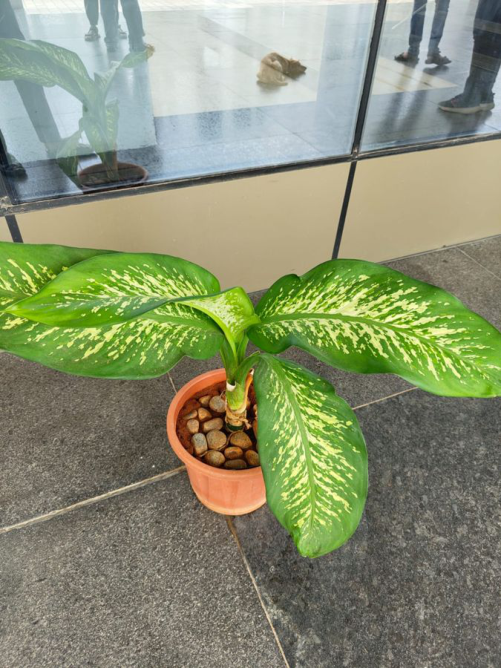

# Dumb Cane / Leopard Lily (`Dieffenbachia seguine`)

| Field Attribute | Taxonomic / Ecological Specification |
| :--- | :--- |
| **Catalog ID** | `FL-33` |
| **Common Name** | Dumb Cane / Leopard Lily |
| **Scientific Name** | *Dieffenbachia seguine* |
| **Botanical Family** | `Araceae` |
| **Category** | Plant (Perennial Aroid) |
| **Location of Observation** | **Outside AB3 block** |
| **Microhabitat** | Potted ornamental, shaded corridor |
| **Trophic Level** | Primary Producer (Trophic Level 1) |
| **Contributing Survey Team** | **Team Rehan** |
| **Survey Source** | Assignment 2 Survey (Team Rehan) |

---

## Field Observation Photograph

---

## Botanical & Morphological Description

Erect perennial with thick succulent canes and large ovate-elliptic dark green leaves heavily variegated with creamy yellow-white mottling.

---

## Ecological Role & Campus Interactions

- **Trophic Role**: Primary Producer (Trophic Level 1)
- **Ecosystem Service**: Broadleaf shade-tolerant foliage plant containing microscopic calcium oxalate raphides. Excellent indoor air purifier used to beautify shaded academic building breezeways.
- **Inter-species Interactions**:
  - Provides vital floral rewards (nectar, pollen) or structural microhabitats for campus biodiversity.
  - Supports pollinators (butterflies, bees, flower-visitors) and detritivore nutrient recycling.
  - Form an integral component of the campus green spaces.

---

[⬅ Back to Flora Index](../README.md) | [🏠 Back to Campus Inventory Root](../../README.md)
