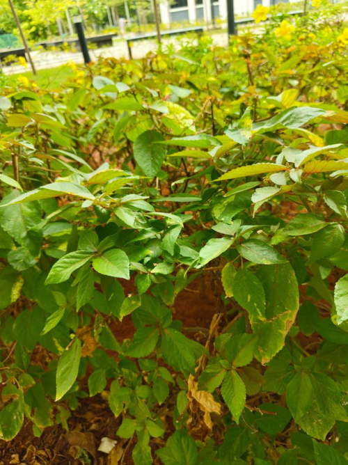

# Bushkiller Vine (`Cayratia japonica`)

| Field Attribute | Taxonomic / Ecological Specification |
| :--- | :--- |
| **Catalog ID** | `FL-34` |
| **Common Name** | Bushkiller Vine |
| **Scientific Name** | *Cayratia japonica* |
| **Botanical Family** | `Vitaceae` |
| **Category** | Plant (Herbaceous Climbing Vine) |
| **Location of Observation** | **Near AB1** |
| **Microhabitat** | Trailing groundcover over shrubs & fence lines |
| **Trophic Level** | Primary Producer (Trophic Level 1) |
| **Contributing Survey Team** | **Team Rehan** |
| **Survey Source** | Assignment 2 Survey (Team Rehan) |

---

## Field Observation Photograph

---

## Botanical & Morphological Description

Perennial climbing herb in the grape family with pentafoliolate palmate leaves, forked tendrils, and small greenish-white flowers developing into dark berries.

---

## Ecological Role & Campus Interactions

- **Trophic Role**: Primary Producer (Trophic Level 1)
- **Ecosystem Service**: Vigorous vine with 5-foliolate compound leaves climbing by branched tendrils. Produces small nectar-bearing flowers that feed wasps and native bees.
- **Inter-species Interactions**:
  - Provides vital floral rewards (nectar, pollen) or structural microhabitats for campus biodiversity.
  - Supports pollinators (butterflies, bees, flower-visitors) and detritivore nutrient recycling.
  - Form an integral component of the campus green spaces.

---

[⬅ Back to Flora Index](../README.md) | [🏠 Back to Campus Inventory Root](../../README.md)
