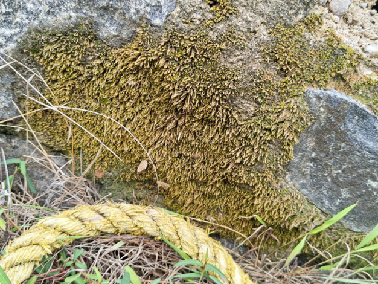

# Campus Lithophytic Moss (`Bryophyta sp.`)

| Field Attribute | Taxonomic / Ecological Specification |
| :--- | :--- |
| **Catalog ID** | `FL-35` |
| **Common Name** | Campus Lithophytic Moss |
| **Scientific Name** | *Bryophyta sp.* |
| **Botanical Family** | `Bryaceae` |
| **Category** | Plant (Non-vascular Bryophyte) |
| **Location of Observation** | **Well near cricket ground** |
| **Microhabitat** | Shaded, constantly moist rock and masonry surfaces |
| **Trophic Level** | Primary Producer (Trophic Level 1) |
| **Contributing Survey Team** | **Team Viswa** |
| **Survey Source** | Assignment 2 Survey (Team Viswa) |

---

## Field Observation Photograph

---

## Botanical & Morphological Description

Dense cushions of miniature green gametophytes with microphyll leaves lacking vascular bundles, anchored to masonry by multicellular rhizoids.

---

## Ecological Role & Campus Interactions

- **Trophic Role**: Primary Producer (Trophic Level 1)
- **Ecosystem Service**: Pioneer non-vascular plant forming spongy velvety green carpets on damp masonry and well rims. Retains atmospheric moisture, prevents erosion, and creates micro-soil for micro-arthropods.
- **Inter-species Interactions**:
  - Provides vital floral rewards (nectar, pollen) or structural microhabitats for campus biodiversity.
  - Supports pollinators (butterflies, bees, flower-visitors) and detritivore nutrient recycling.
  - Form an integral component of the campus green spaces.

---

[Back to Flora Index](../README.md) | [Back to Campus Inventory Root](../../README.md)
