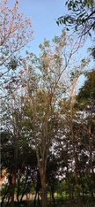

# Pink Trumpet Tree / Rosy Trumpet Tree (`Tabebuia rosea`)

| Field Attribute | Taxonomic / Ecological Specification |
| :--- | :--- |
| **Catalog ID** | `FL-36` |
| **Common Name** | Pink Trumpet Tree / Rosy Trumpet Tree |
| **Scientific Name** | *Tabebuia rosea* |
| **Botanical Family** | `Bignoniaceae` |
| **Category** | Plant (Deciduous Flowering Tree) |
| **Location of Observation** | **Central Avenue & Quadrangle Borders** |
| **Microhabitat** | Landscaped avenues and open, sunny spaces |
| **Trophic Level** | Primary Producer (Trophic Level 1) |
| **Contributing Survey Team** | **Team Shatmika** |
| **Survey Source** | Assignment 2 Survey (Team Shatmika) |

---

## Field Observation Photograph

---

## Botanical & Morphological Description

Medium to large tree with palmately compound leaves and showy pale-pink to lilac, trumpet-shaped flowers borne in dense clusters, often while the crown is nearly leafless. Native to Central America and northern South America and widely planted as an ornamental avenue tree.

---

## Ecological Role & Campus Interactions

- **Trophic Role**: Primary Producer (Trophic Level 1)
- **Ecosystem Service**: Medium to large deciduous tree bearing showy pale-pink to lilac trumpet blossoms in dense corymbose clusters, offering a massive seasonal nectar flush for bees, butterflies, and sunbirds.
- **Inter-species Interactions**:
  - Provides vital floral rewards (nectar, pollen) or structural microhabitats for campus biodiversity.
  - Supports pollinators (butterflies, bees, flower-visitors) and detritivore nutrient recycling.
  - Forms an integral component of the campus green spaces.

---

[Back to Flora Index](../README.md) | [Back to Campus Inventory Root](../../README.md)
