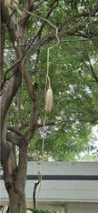

# Sausage Tree (`Kigelia africana`)

| Field Attribute | Taxonomic / Ecological Specification |
| :--- | :--- |
| **Catalog ID** | `FL-37` |
| **Common Name** | Sausage Tree |
| **Scientific Name** | *Kigelia africana* |
| **Botanical Family** | `Bignoniaceae` |
| **Category** | Plant (Deciduous Flowering Tree) |
| **Location of Observation** | **Campus Perimeter Gardens & Lawn Borders** |
| **Microhabitat** | Open landscaped lawns and moist soil edges |
| **Trophic Level** | Primary Producer (Trophic Level 1) |
| **Contributing Survey Team** | **Team Shatmika** |
| **Survey Source** | Assignment 2 Survey (Team Shatmika) |

---

## Field Observation Photograph

---

## Botanical & Morphological Description

Stout tree with rough grey bark, pinnate leaves, and nocturnal maroon cup-shaped flowers hanging on long rope-like peduncles. The heavy, gourd-like fibrous fruits hang suspended beneath the spreading canopy.

---

## Ecological Role & Campus Interactions

- **Trophic Role**: Primary Producer (Trophic Level 1)
- **Ecosystem Service**: Distinctive spreading tree bearing nocturnal maroon-red cup-shaped flowers pollinated primarily by fruit bats, followed by massive woody pendulum-suspended sausage-like fruits.
- **Inter-species Interactions**:
  - Provides vital floral rewards (nectar, pollen) or structural microhabitats for campus biodiversity.
  - Supports pollinators (butterflies, bees, flower-visitors) and detritivore nutrient recycling.
  - Forms an integral component of the campus green spaces.

---

[⬅ Back to Flora Index](../README.md) | [🏠 Back to Campus Inventory Root](../../README.md)
