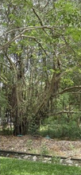

# Banyan Tree / Indian Banyan (`Ficus benghalensis`)

| Field Attribute | Taxonomic / Ecological Specification |
| :--- | :--- |
| **Catalog ID** | `FL-38` |
| **Common Name** | Banyan Tree / Indian Banyan |
| **Scientific Name** | *Ficus benghalensis* |
| **Botanical Family** | `Moraceae` |
| **Category** | Plant (Keystone Canopy Tree / Moraceae) |
| **Location of Observation** | **Campus Boundary & Temple Groves** |
| **Microhabitat** | Open campus boundary, deep soil with ample canopy space |
| **Trophic Level** | Primary Producer (Trophic Level 1) |
| **Contributing Survey Team** | **Team Shatmika** |
| **Survey Source** | Assignment 2 Survey (Team Shatmika) |

---

## Field Observation Photograph

---

## Botanical & Morphological Description

Massive evergreen tree producing copious aerial prop roots that drop to the ground and form secondary woody trunks. Thick leathery ovate leaves with prominent pale veins and paired sessile red figs.

---

## Ecological Role & Campus Interactions

- **Trophic Role**: Primary Producer (Trophic Level 1)
- **Ecosystem Service**: National Tree of India and ecological keystone species. Its massive spreading canopy and aerial prop roots support hundreds of birds, fruit bats, squirrels, and insects with year-round fig crops.
- **Inter-species Interactions**:
  - Provides vital floral rewards (nectar, pollen) or structural microhabitats for campus biodiversity.
  - Supports pollinators (butterflies, bees, flower-visitors) and detritivore nutrient recycling.
  - Forms an integral component of the campus green spaces.

---

[⬅ Back to Flora Index](../README.md) | [🏠 Back to Campus Inventory Root](../../README.md)
