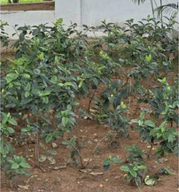

# Tea Plant (`Camellia sinensis`)

| Field Attribute | Taxonomic / Ecological Specification |
| :--- | :--- |
| **Catalog ID** | `FL-39` |
| **Common Name** | Tea Plant |
| **Scientific Name** | *Camellia sinensis* |
| **Botanical Family** | `Theaceae` |
| **Category** | Plant (Evergreen Shrub / Theaceae) |
| **Location of Observation** | **Botanical Display Garden & Potted Planters** |
| **Microhabitat** | Moist, acidic soil under partial canopy shade |
| **Trophic Level** | Primary Producer (Trophic Level 1) |
| **Contributing Survey Team** | **Team Shatmika** |
| **Survey Source** | Assignment 2 Survey (Team Shatmika) |

---

## Field Observation Photograph

---

## Botanical & Morphological Description

Small evergreen shrub or small tree with glossy dark green elliptic serrated leaves and fragrant solitary white flowers with central bunches of golden-yellow stamens.

---

## Ecological Role & Campus Interactions

- **Trophic Role**: Primary Producer (Trophic Level 1)
- **Ecosystem Service**: Evergreen shrub featuring serrated aromatic leaves and white nodding flowers with rich yellow stamens. Supports solitary bees and micro-pollinators.
- **Inter-species Interactions**:
  - Provides vital floral rewards (nectar, pollen) or structural microhabitats for campus biodiversity.
  - Supports pollinators (butterflies, bees, flower-visitors) and detritivore nutrient recycling.
  - Forms an integral component of the campus green spaces.

---

[⬅ Back to Flora Index](../README.md) | [🏠 Back to Campus Inventory Root](../../README.md)
