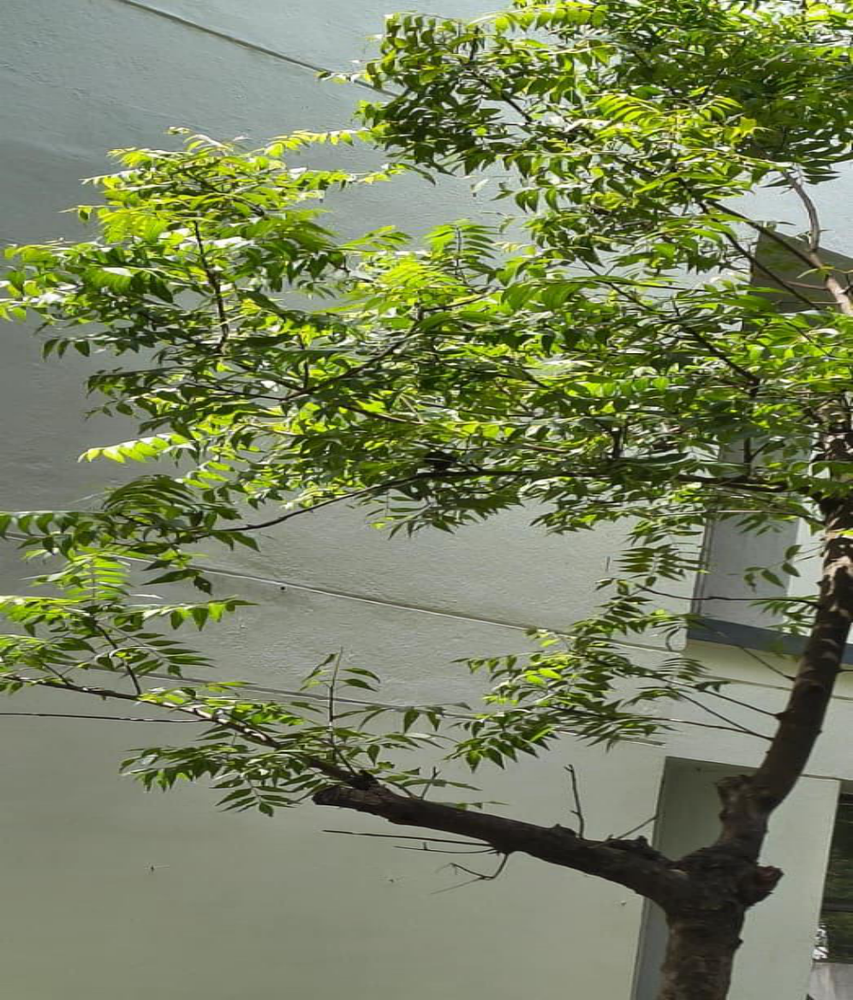

# Neem Tree / Indian Lilac / Margosa Tree (`Azadirachta indica`)

| Field Attribute | Taxonomic / Ecological Specification |
| :--- | :--- |
| **Catalog ID** | `FL-41` |
| **Common Name** | Neem Tree / Indian Lilac / Margosa Tree |
| **Scientific Name** | *Azadirachta indica* |
| **Botanical Family** | `Meliaceae` |
| **Category** | Plant (Evergreen Canopy Tree / Meliaceae) |
| **Location of Observation** | **Campus Temple & Green Belts** |
| **Microhabitat** | Temple grounds, avenue borders, arid campus soil |
| **Trophic Level** | Primary Producer (Trophic Level 1) |
| **Contributing Survey Team** | **Team Sasthika** |
| **Survey Source** | Assignment 2 Survey (Team Sasthika - Team 33) |

---

## Field Observation Photograph

---

## Botanical & Morphological Description

Large, spreading, fast-growing evergreen tree with pinnate leaves consisting of 20 to 30 falcate-serrated leaflets and fragrant white axillary panicles followed by small golden-yellow drupes.

---

## Ecological Role & Campus Interactions

- **Trophic Role**: Primary Producer (Trophic Level 1)
- **Ecosystem Service**: Revered native evergreen tree producing azadirachtin-rich foliage and bark with potent bio-pesticidal and anti-microbial properties. Provides deep cooling shade, canopy cover, and edible drupes for birds and bats.
- **Inter-species Interactions**:
  - Provides vital floral rewards (nectar, pollen) or structural microhabitats for campus biodiversity.
  - Supports pollinators (butterflies, bees, flower-visitors) and detritivore nutrient recycling.
  - Forms an integral component of the campus green spaces.

---

[⬅ Back to Flora Index](../README.md) | [🏠 Back to Campus Inventory Root](../../README.md)
