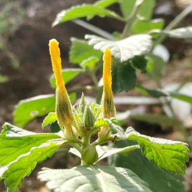

# 🌿 Elephant's Foot (*Elephantopus scaber*)

## 📌 Taxonomy & Classification
- **ID**: FL-42
- **Common Name**: Elephant's Foot / Prickly Chaff Flower
- **Scientific Name**: *Elephantopus scaber*
- **Family**: Asteraceae
- **Order**: Asterales
- **Category**: Herbaceous Wildflower (Asteraceae / Herb)
- **Sub-Category**: Herbs & Groundcover

## 📍 Habitat & Occurrence
- **Location**: Central Campus Manicured Lawns
- **Habitat**: Open manicured grass turf and sunny garden borders
- **Survey Source**: Assignment 2 Survey (Team Asmath)
- **Contributor Team**: Team Asmath

## 🔬 Ecological Role & Description
- **Trophic Level**: Primary Producer (Trophic Level 1)
- **Ecological Role**: Perennial taprooted herb with a basal rosette of leaves. Serves as a ground-layer primary producer, soil stabilizer, and nectar source for micro-insects.
- **Description**: Herbaceous perennial characterized by rigid rosette leaves closely appressed to the soil and an erect, dichotomously branched flowering stem bearing pale violet flower heads.

---
[🏠 Return to Flora Index](../README.md) | [📊 View Inventory Data](../../data/biodiversity_inventory.json)
