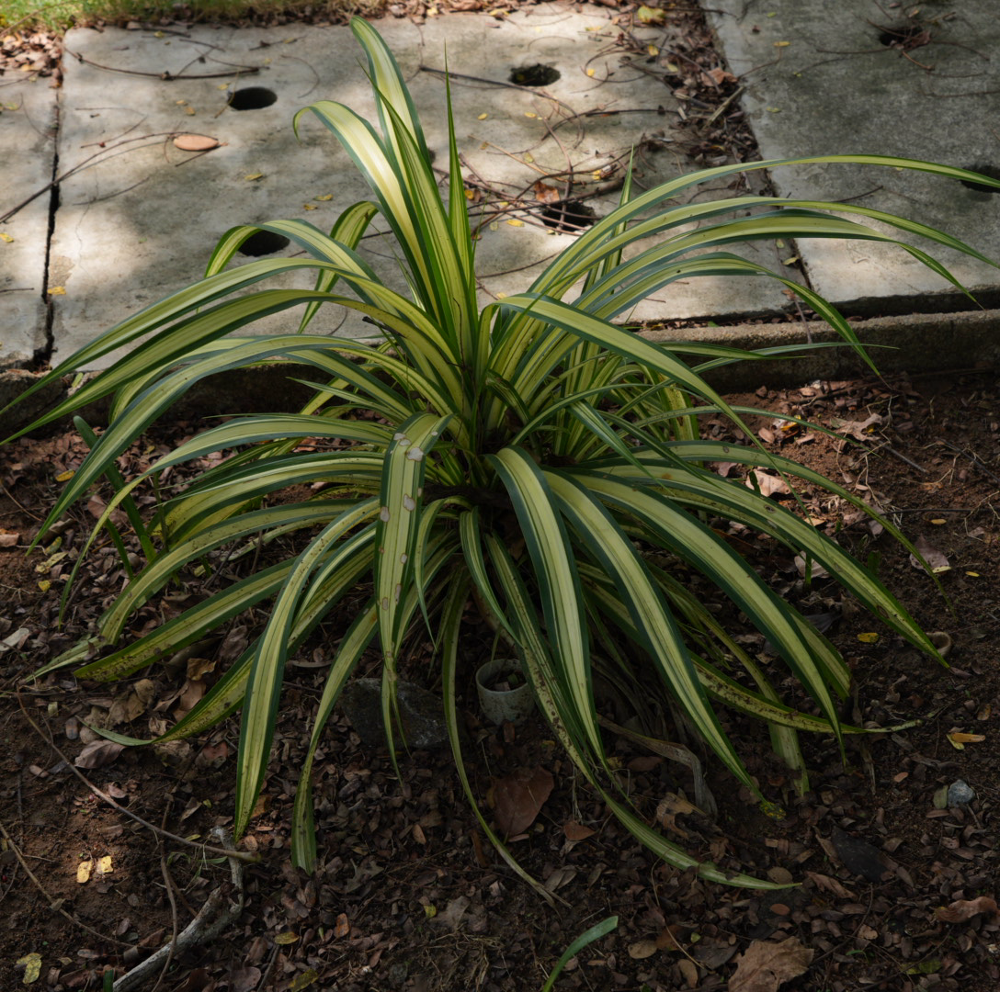

# Variegated Screw Pine (`Pandanus sanderi`)

| Field Attribute | Taxonomic / Ecological Specification |
| :--- | :--- |
| **Catalog ID** | `FL-43` |
| **Common Name** | Variegated Screw Pine |
| **Scientific Name** | *Pandanus sanderi* |
| **Botanical Family** | `Pandanaceae` |
| **Category** | Plant (Ornamental Evergreen Foliage Shrub / Herb) |
| **Location of Observation** | **Clock Tower** |
| **Microhabitat** | Garden bed / landscaped habitat |
| **Trophic Level** | Primary Producer (Trophic Level 1) |
| **Contributing Survey Team** | **Team Manoj** |
| **Survey Source** | Assignment 2 Survey (Team Manoj) |

---

## Field Observation Photograph

---

## Botanical & Morphological Description

Perennial evergreen suckering shrub with spirally arranged, arching strap-like leaves lined with fine marginal prickles and brilliant golden-yellow longitudinal bands flanking green margins.

---

## Ecological Role & Campus Interactions

- **Trophic Role**: Primary Producer (Trophic Level 1)
- **Ecosystem Service**: Forms dense rosettes of arching spiny strap leaves with yellow-gold and green stripes. Stabilizes soil with prop roots and provides sheltered microclimates for campus ground invertebrates and micro-fauna.
- **Inter-species Interactions**:
  - Provides essential floral nectar, pollen resources, and structural microhabitat for campus biodiversity.
  - Supports beneficial pollinating insects (butterflies, bees) and detrital soil nutrient cycling.
  - Forms an integral component of the campus landscaped green spaces and ornamental gardens.

---

[⬅ Back to Flora Index](../README.md) | [🏠 Back to Campus Inventory Root](../../README.md)
