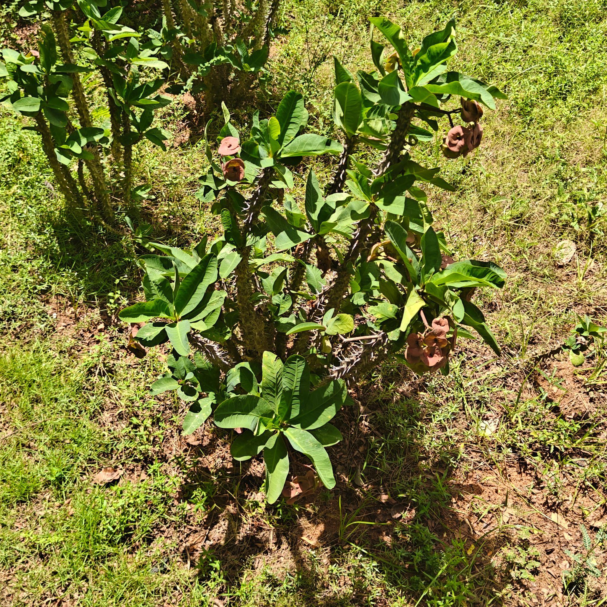

# Crown of Thorns / Christ Plant (`Euphorbia milii`)

| Field Attribute | Taxonomic / Ecological Specification |
| :--- | :--- |
| **Catalog ID** | `FL-44` |
| **Common Name** | Crown of Thorns / Christ Plant |
| **Scientific Name** | *Euphorbia milii* |
| **Botanical Family** | `Euphorbiaceae` |
| **Category** | Plant (Spiny Succulent Shrub) |
| **Location of Observation** | **Clock Tower** |
| **Microhabitat** | Grassland / landscaped vegetation |
| **Trophic Level** | Primary Producer (Trophic Level 1) |
| **Contributing Survey Team** | **Team Manoj** |
| **Survey Source** | Assignment 2 Survey (Team Manoj) |

---

## Field Observation Photograph

---

## Botanical & Morphological Description

Semi-succulent sprawling shrub bearing stout spines along its stems, obovate bright green leaves, and long-lasting pairs of vivid red petaloid bracts (cyathophylls) surrounding miniature true flowers.

---

## Ecological Role & Campus Interactions

- **Trophic Role**: Primary Producer (Trophic Level 1)
- **Ecosystem Service**: Drought-hardy succulent shrub with dense spines and nectar-rich cyathia that sustain ants, native bees, and small butterflies while toxic diterpene latex deters vertebrate herbivory.
- **Inter-species Interactions**:
  - Provides essential floral nectar, pollen resources, and structural microhabitat for campus biodiversity.
  - Supports beneficial pollinating insects (butterflies, bees) and detrital soil nutrient cycling.
  - Forms an integral component of the campus landscaped green spaces and ornamental gardens.

---

[Back to Flora Index](../README.md) | [Back to Campus Inventory Root](../../README.md)
