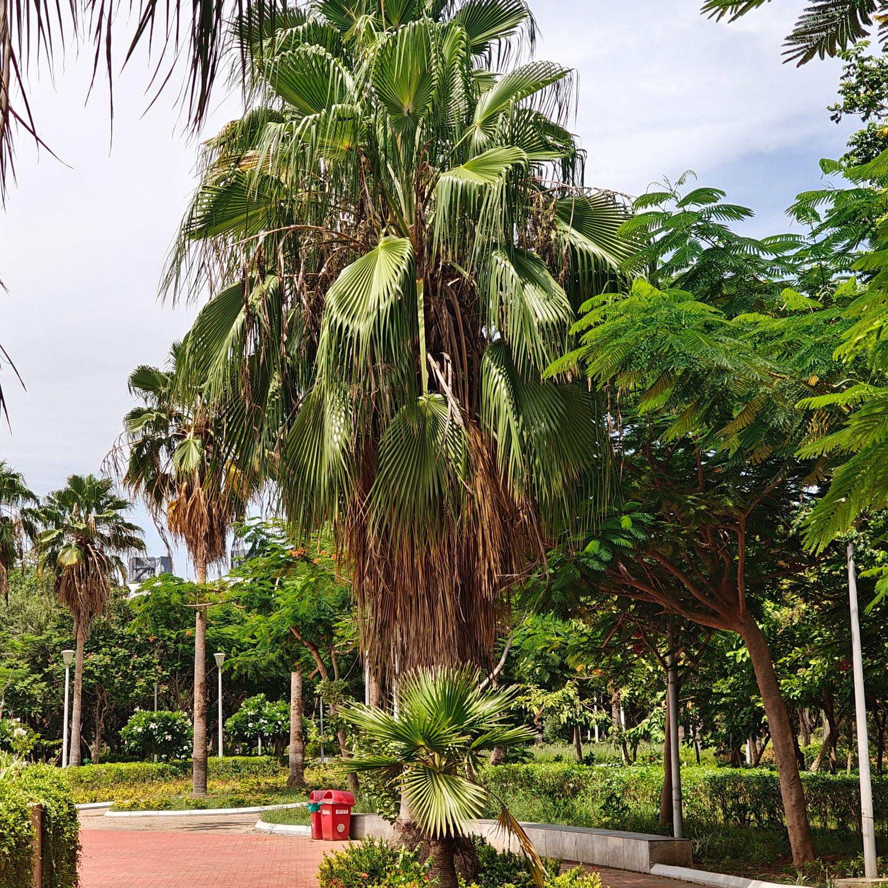

# California Fan Palm / Desert Fan Palm (`Washingtonia filifera`)

| Field Attribute | Taxonomic / Ecological Specification |
| :--- | :--- |
| **Catalog ID** | `FL-45` |
| **Common Name** | California Fan Palm / Desert Fan Palm |
| **Scientific Name** | *Washingtonia filifera* |
| **Botanical Family** | `Arecaceae` |
| **Category** | Plant (Solitary Fan Palm / Tree) |
| **Location of Observation** | **Clock Tower** |
| **Microhabitat** | Landscaped garden / ornamental vegetation |
| **Trophic Level** | Primary Producer (Trophic Level 1) |
| **Contributing Survey Team** | **Team Manoj** |
| **Survey Source** | Assignment 2 Survey (Team Manoj) |

---

## Field Observation Photograph

---

## Botanical & Morphological Description

Massive solitary palm with a stout columnar trunk and an open spherical crown of gray-green costapalmate fan fronds bearing conspicuous white thread-like fibers along the leaf segments.

---

## Ecological Role & Campus Interactions

- **Trophic Role**: Primary Producer (Trophic Level 1)
- **Ecosystem Service**: Imposing architectural palm providing high-canopy roosts, shaded perches for insectivorous and passerine birds, and dense petticoat thatch serving as a specialized microhabitat for insects.
- **Inter-species Interactions**:
  - Provides essential floral nectar, pollen resources, and structural microhabitat for campus biodiversity.
  - Supports beneficial pollinating insects (butterflies, bees) and detrital soil nutrient cycling.
  - Forms an integral component of the campus landscaped green spaces and ornamental gardens.

---

[⬅ Back to Flora Index](../README.md) | [🏠 Back to Campus Inventory Root](../../README.md)
