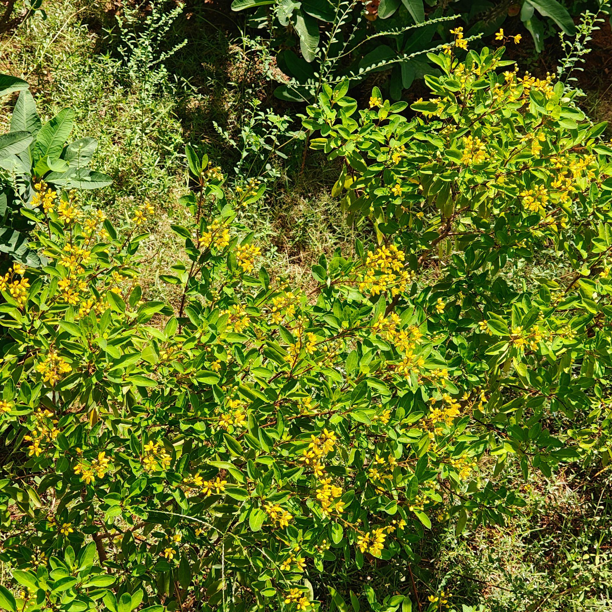

# Golden Thryallis / Rain of Gold (`Galphimia gracilis`)

| Field Attribute | Taxonomic / Ecological Specification |
| :--- | :--- |
| **Catalog ID** | `FL-46` |
| **Common Name** | Golden Thryallis / Rain of Gold |
| **Scientific Name** | *Galphimia gracilis* |
| **Botanical Family** | `Malpighiaceae` |
| **Category** | Plant (Flowering Shrub) |
| **Location of Observation** | **Water Fountain** |
| **Microhabitat** | Landscaped garden / ornamental vegetation |
| **Trophic Level** | Primary Producer (Trophic Level 1) |
| **Contributing Survey Team** | **Team Manoj** |
| **Survey Source** | Assignment 2 Survey (Team Manoj) |

---

## Field Observation Photograph

---

## Botanical & Morphological Description

Fast-growing evergreen shrub with slender reddish-brown stems, opposite ovate blue-green leaves, and abundant terminal racemes of star-shaped bright yellow flowers accented with red-tinged stamens.

---

## Ecological Role & Campus Interactions

- **Trophic Role**: Primary Producer (Trophic Level 1)
- **Ecosystem Service**: Continuously blooming nectar shrub that serves as an indispensable campus pollinator resource, constantly visited by honeybees, syrphid flies, and butterflies around the water fountain.
- **Inter-species Interactions**:
  - Provides essential floral nectar, pollen resources, and structural microhabitat for campus biodiversity.
  - Supports beneficial pollinating insects (butterflies, bees) and detrital soil nutrient cycling.
  - Forms an integral component of the campus landscaped green spaces and ornamental gardens.

---

[⬅ Back to Flora Index](../README.md) | [🏠 Back to Campus Inventory Root](../../README.md)
