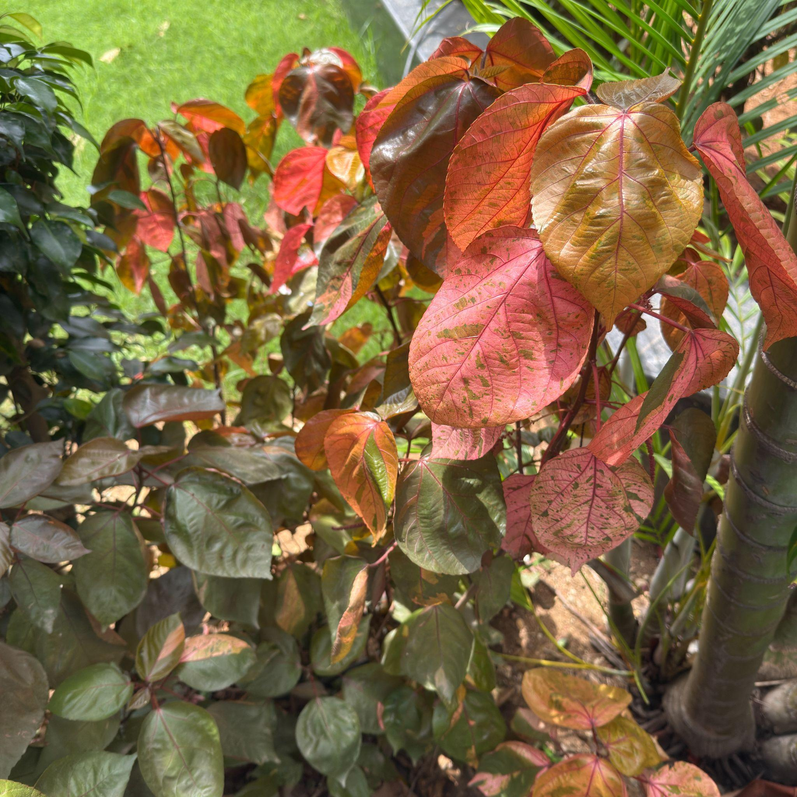

# Copperleaf Plant / Jacob's Coat (`Acalypha wilkesiana`)

| Field Attribute | Taxonomic / Ecological Specification |
| :--- | :--- |
| **Catalog ID** | `FL-47` |
| **Common Name** | Copperleaf Plant / Jacob's Coat |
| **Scientific Name** | *Acalypha wilkesiana* |
| **Botanical Family** | `Euphorbiaceae` |
| **Category** | Plant (Ornamental Evergreen Shrub) |
| **Location of Observation** | **JP Auditorium** |
| **Microhabitat** | Landscaped garden / ornamental shrubs |
| **Trophic Level** | Primary Producer (Trophic Level 1) |
| **Contributing Survey Team** | **Team Manoj** |
| **Survey Source** | Assignment 2 Survey (Team Manoj) |

---

## Field Observation Photograph

---

## Botanical & Morphological Description

Vibrant evergreen shrub cultivated for its spectacular heart-shaped, serrated leaves mottled with coppery-bronze, crimson, dark green, and bright magenta-pink edges.

---

## Ecological Role & Campus Interactions

- **Trophic Role**: Primary Producer (Trophic Level 1)
- **Ecosystem Service**: Provides dense lower-canopy foliage cover, shade, and foliar habitat for micro-arthropods and spiders while enhancing the campus landscaped ecotone around academic halls.
- **Inter-species Interactions**:
  - Provides essential floral nectar, pollen resources, and structural microhabitat for campus biodiversity.
  - Supports beneficial pollinating insects (butterflies, bees) and detrital soil nutrient cycling.
  - Forms an integral component of the campus landscaped green spaces and ornamental gardens.

---

[⬅ Back to Flora Index](../README.md) | [🏠 Back to Campus Inventory Root](../../README.md)
