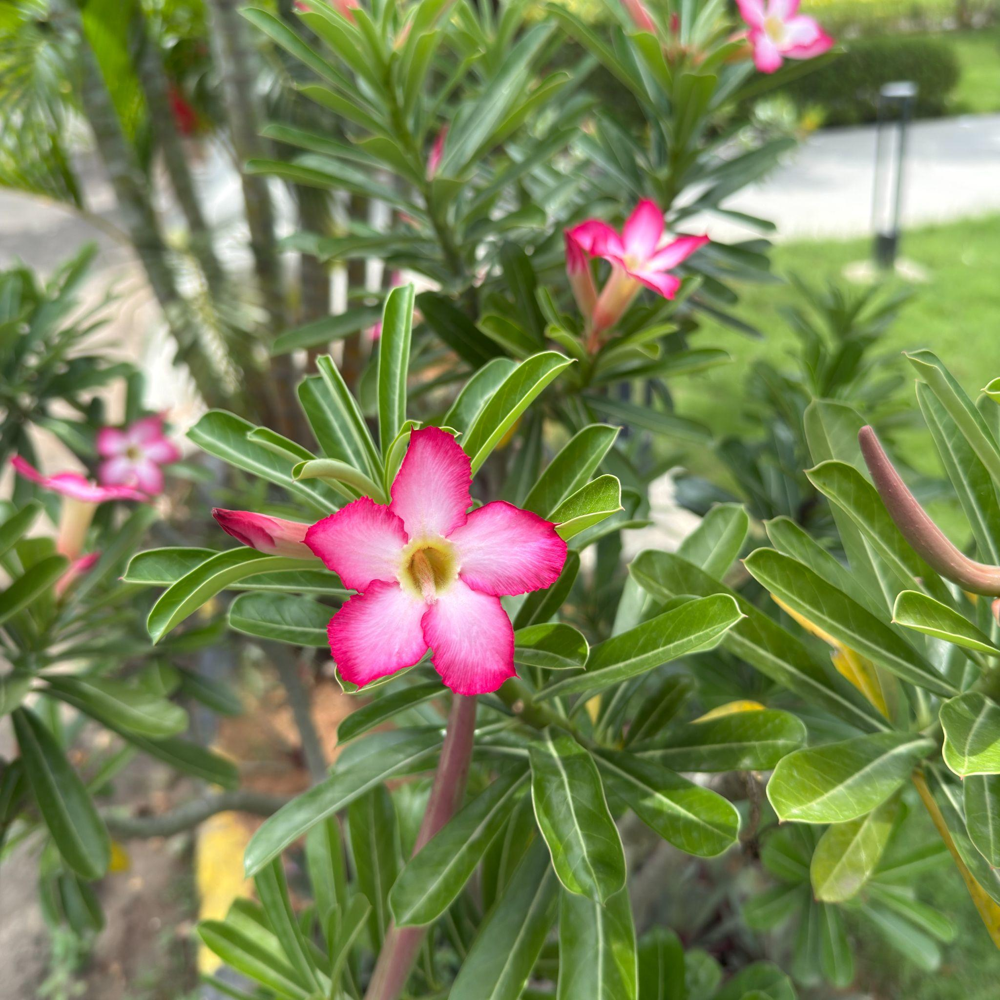

# Desert Rose (`Adenium obesum`)

| Field Attribute | Taxonomic / Ecological Specification |
| :--- | :--- |
| **Catalog ID** | `FL-49` |
| **Common Name** | Desert Rose |
| **Scientific Name** | *Adenium obesum* |
| **Botanical Family** | `Apocynaceae` |
| **Category** | Plant (Pachycaul Succulent Shrub) |
| **Location of Observation** | **JP Auditorium** |
| **Microhabitat** | Landscaped garden / potted succulent habitat |
| **Trophic Level** | Primary Producer (Trophic Level 1) |
| **Contributing Survey Team** | **Team Manoj** |
| **Survey Source** | Assignment 2 Survey (Team Manoj) |

---

## Field Observation Photograph

---

## Botanical & Morphological Description

Pachycaul succulent shrub with a swollen basal caudex, smooth grayish-green bark, spirally arranged glossy leathery leaves, and stunning deep-pink tubular flowers with paler throats.

---

## Ecological Role & Campus Interactions

- **Trophic Role**: Primary Producer (Trophic Level 1)
- **Ecosystem Service**: Extremely drought-adapted succulent storing water in its caudex, offering nectar rewards for specialized long-proboscis pollinators while maintaining architectural desert landscaping.
- **Inter-species Interactions**:
  - Provides essential floral nectar, pollen resources, and structural microhabitat for campus biodiversity.
  - Supports beneficial pollinating insects (butterflies, bees) and detrital soil nutrient cycling.
  - Forms an integral component of the campus landscaped green spaces and ornamental gardens.

---

[⬅ Back to Flora Index](../README.md) | [🏠 Back to Campus Inventory Root](../../README.md)
