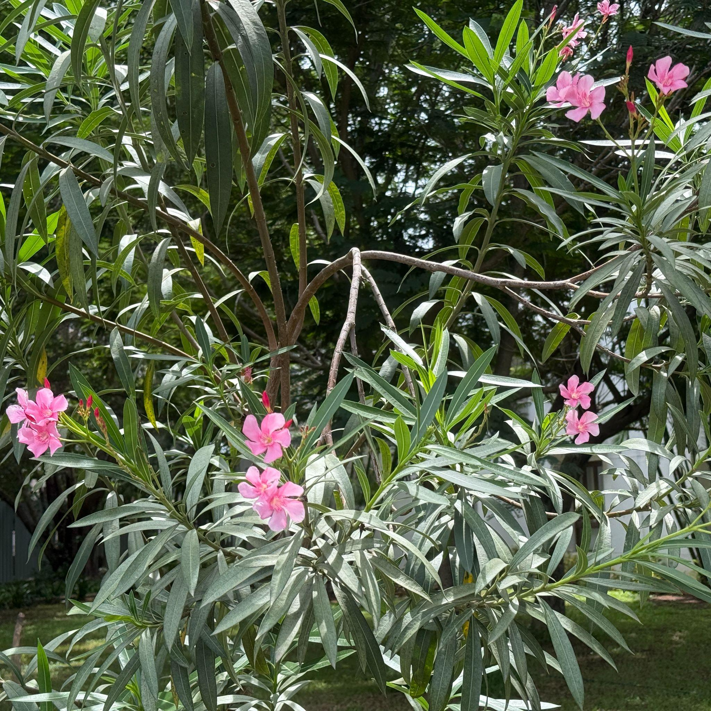

# Oleander / Kaner (`Nerium oleander`)

| Field Attribute | Taxonomic / Ecological Specification |
| :--- | :--- |
| **Catalog ID** | `FL-50` |
| **Common Name** | Oleander / Kaner |
| **Scientific Name** | *Nerium oleander* |
| **Botanical Family** | `Apocynaceae` |
| **Category** | Plant (Evergreen Flowering Shrub) |
| **Location of Observation** | **JP Auditorium** |
| **Microhabitat** | Landscaped garden / perimeter hedge |
| **Trophic Level** | Primary Producer (Trophic Level 1) |
| **Contributing Survey Team** | **Team Manoj** |
| **Survey Source** | Assignment 2 Survey (Team Manoj) |

---

## Field Observation Photograph

---

## Botanical & Morphological Description

Hardy erect evergreen shrub with whorled, leathery narrow lanceolate leaves with prominent parallel veins, bearing terminal cymes of showy fragrant 5-lobed rose-pink flowers.

---

## Ecological Role & Campus Interactions

- **Trophic Role**: Primary Producer (Trophic Level 1)
- **Ecosystem Service**: Hardy drought-tolerant hedge shrub that provides dense boundary screening, pollen/nectar forage for diurnal bees and nocturnal sphingid moths, and bio-protection via cardiac glycosides.
- **Inter-species Interactions**:
  - Provides essential floral nectar, pollen resources, and structural microhabitat for campus biodiversity.
  - Supports beneficial pollinating insects (butterflies, bees) and detrital soil nutrient cycling.
  - Forms an integral component of the campus landscaped green spaces and ornamental gardens.

---

[Back to Flora Index](../README.md) | [Back to Campus Inventory Root](../../README.md)
