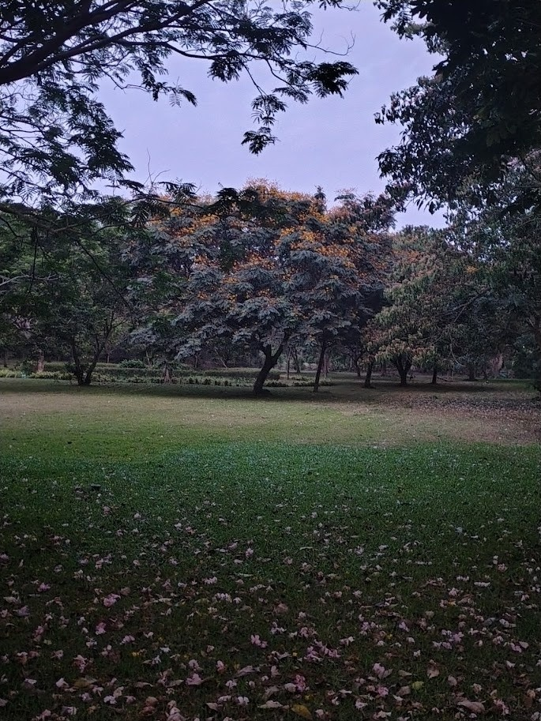

# Copperpod Tree / Yellow Flame Tree (`Peltophorum pterocarpum`)

| Field Attribute | Taxonomic / Ecological Specification |
| :--- | :--- |
| **Catalog ID** | `FL-51` |
| **Common Name** | Copperpod Tree / Yellow Flame Tree / Rusty Shield Bearer |
| **Scientific Name** | *Peltophorum pterocarpum* |
| **Botanical Family** | `Fabaceae (Caesalpinioideae)` |
| **Category** | Plant (Deciduous Flowering Shade Tree) |
| **Location of Observation** | **Near the Main Canteen** |
| **Microhabitat** | Landscaped campus road / Canteen walkway border |
| **Trophic Level** | Primary Producer (Trophic Level 1) |
| **Contributing Survey Team** | **Team Yagna Sanjeev** |
| **Survey Source** | Assignment 2 Survey (Team Yagna Sanjeev) |

---

## Field Observation Photograph

---

## Botanical & Morphological Description

A majestic deciduous flowering tree native to tropical Indo-Malaya. Characterized by a broad, spreading umbrella crown, fine bipinnate feathery leaves, and dense terminal clusters of fragrant bright yellow flowers that carpet the ground when they fall. Followed by distinctive flattened coppery-brown woody seed pods.

---

## Ecological Role & Campus Interactions

- **Trophic Role**: Primary Producer (Trophic Level 1)
- **Ecosystem Service**: Significant urban shade tree with high aesthetic and ecological value. Its abundant yellow blooms supply rich nectar to pollinators, while its extensive canopy intercepts rainfall and mitigates the campus urban heat island effect.
- **Inter-species Interactions**:
  - Major nectar and pollen resource for honeybees (*Apis cerana*), stingless bees, and butterflies.
  - Canopy branches provide nesting sites, perches, and roosting shelter for avifauna like *Acridotheres tristis* and *Argya striata*.
  - Fallen leaves and pods enrich the soil with organic matter, nourishing macro-decomposers like millipedes.

---

[Back to Flora Index](../README.md) | [Back to Campus Inventory Root](../../README.md)
