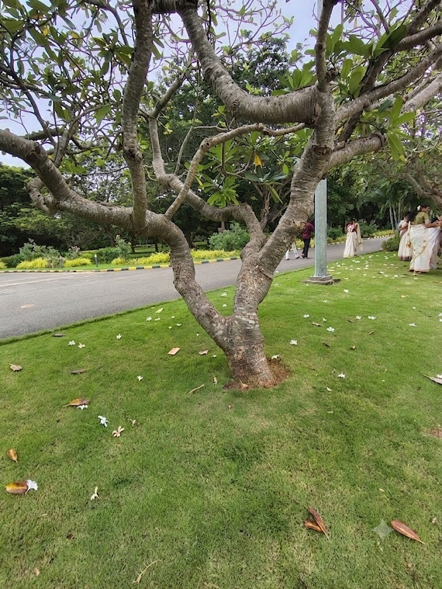

# Rain Tree / Monkey Pod (`Samanea saman`)

| Field Attribute | Taxonomic / Ecological Specification |
| :--- | :--- |
| **Catalog ID** | `FL-52` |
| **Common Name** | Rain Tree / Monkey Pod / Five O'Clock Tree |
| **Scientific Name** | *Samanea saman (syn. Albizia saman)* |
| **Botanical Family** | `Fabaceae (Mimosoideae)` |
| **Category** | Plant (Large Canopy Shade Tree) |
| **Location of Observation** | **Justice Prathap Auditorium Premises** |
| **Microhabitat** | Open manicured lawn / Auditorium perimeter landscape |
| **Trophic Level** | Primary Producer (Trophic Level 1) |
| **Contributing Survey Team** | **Team Yagna Sanjeev** |
| **Survey Source** | Assignment 2 Survey (Team Yagna Sanjeev) |

---

## Field Observation Photograph

---

## Botanical & Morphological Description

A massive, broad-crowned spreading canopy tree renowned for its umbrella-like silhouette. Foliage consists of bipinnate leaves that fold together during overcast, rainy weather and at dusk ('sleeping tree'). Flowers are showy spherical clusters with numerous long pinkish-crimson and white stamens, producing dark fleshy pods.

---

## Ecological Role & Campus Interactions

- **Trophic Role**: Primary Producer (Trophic Level 1)
- **Ecosystem Service**: Forms a critical keystone structural component of campus greenery. Nitrogen-fixing tree that enriches lawn soils, produces extensive shade cooling large ground areas, and hosts diverse epiphytes, lichens, and climbing fauna.
- **Inter-species Interactions**:
  - Foliage and sweet sticky pods serve as food for Indian Palm Squirrels (*Funambulus palmarum*) and Bonnet Macaques (*Macaca radiata*).
  - Wide horizontal boughs provide prime nesting territory for Indian Peafowl (*Pavo cristatus*) and Asian Koels (*Eudynamys scolopaceus*).
  - Nectar-rich flowers attract pollinating insects and diurnal birds.

---

[Back to Flora Index](../README.md) | [Back to Campus Inventory Root](../../README.md)
