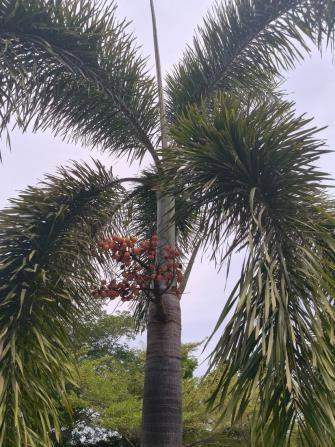

# Betel Nut Palm (`Areca catechu`)

| Field Attribute | Taxonomic / Ecological Specification |
| :--- | :--- |
| **Catalog ID** | `FL-53` |
| **Common Name** | Betel Nut Palm / Areca Palm / Supari Palm |
| **Scientific Name** | *Areca catechu* |
| **Botanical Family** | `Arecaceae` |
| **Category** | Plant (Slender Solitary Canopy Palm / Tree) |
| **Location of Observation** | **Zone D — Management Block Garden** |
| **Microhabitat** | Irrigated landscaped lawn bed |
| **Trophic Level** | Primary Producer (Trophic Level 1) |
| **Contributing Survey Team** | **Team Venkatadri** |
| **Survey Source** | Assignment 2 Survey (Team Venkatadri) |

---

## Field Observation Photograph

---

## Botanical & Morphological Description

A tall, slender solitary feather palm growing with a smooth, straight green-to-grey trunk marked with conspicuous ring-shaped leaf scars. Crown consists of a compact cluster of pinnate fronds with crowded leaflets, bearing branching inflorescences beneath the crownshaft that mature into clusters of smooth orange-red fibrous drupes.

---

## Ecological Role & Campus Interactions

- **Trophic Role**: Primary Producer (Trophic Level 1)
- **Ecosystem Service**: Landscaped vertical canopy accent plant that stabilizes irrigated soils, intercepts rainfall, and provides nectar forage during flowering periods.
- **Inter-species Interactions**:
  - Inflorescences attract honeybees and diverse micro-pollinators.
  - Fibrous fruit bunches and high canopy fronds offer roosting shelter for avifauna and squirrels.

---

[Back to Flora Index](../README.md) | [Back to Campus Inventory Root](../../README.md)
