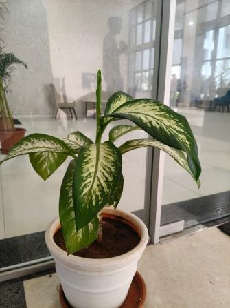

# Golden Cane Palm (`Dypsis lutescens`)

| Field Attribute | Taxonomic / Ecological Specification |
| :--- | :--- |
| **Catalog ID** | `FL-54` |
| **Common Name** | Golden Cane Palm / Areca Palm / Butterfly Palm / Yellow Palm |
| **Scientific Name** | *Dypsis lutescens* |
| **Botanical Family** | `Arecaceae` |
| **Category** | Plant (Clumping Ornamental Palm / Shrub) |
| **Location of Observation** | **Zone C — Academic Block Foyer** |
| **Microhabitat** | Indoor architectural container / Diffuse light courtyard |
| **Trophic Level** | Primary Producer (Trophic Level 1) |
| **Contributing Survey Team** | **Team Venkatadri** |
| **Survey Source** | Assignment 2 Survey (Team Venkatadri) |

---

## Field Observation Photograph

---

## Botanical & Morphological Description

A popular clumping feather palm with multiple slender yellowish-golden cane-like ringed trunks emerging from the base. Produces upward-arching, feathery pinnate fronds with golden-yellow petioles and midribs, widely cultivated for foyer decoration and architectural indoor-outdoor landscaping.

---

## Ecological Role & Campus Interactions

- **Trophic Role**: Primary Producer (Trophic Level 1)
- **Ecosystem Service**: Excellent indoor-outdoor air-purifying ornamental plant that absorbs volatile organic compounds, transpires moisture to maintain indoor humidity, and provides structural greenery in shaded foyers.
- **Inter-species Interactions**:
  - Provides sheltered resting micro-niches for small geckos, ants, and indoor spiders.

---

[Back to Flora Index](../README.md) | [Back to Campus Inventory Root](../../README.md)
