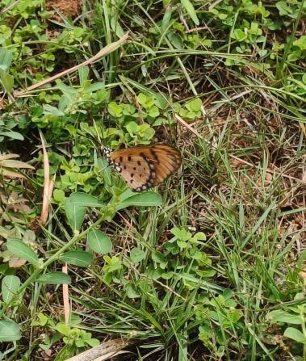

# Sessile Joyweed / Ponnanganni (`Alternanthera sessilis`)

| Field Attribute | Taxonomic / Ecological Specification |
| :--- | :--- |
| **Catalog ID** | `FL-55` |
| **Common Name** | Sessile Joyweed / Ponnanganni / Dwarf Copperleaf |
| **Scientific Name** | *Alternanthera sessilis* |
| **Botanical Family** | `Amaranthaceae` |
| **Category** | Plant (Prostrate Wild Herb / Groundcover) |
| **Location of Observation** | **Zone A — Sports Complex Lawns** |
| **Microhabitat** | Prostrate herbaceous mat interspersed within mown turf |
| **Trophic Level** | Primary Producer (Trophic Level 1) |
| **Contributing Survey Team** | **Team Venkatadri** |
| **Survey Source** | Assignment 2 Survey (Team Venkatadri) |

---

## Field Observation Photograph

---

## Botanical & Morphological Description

A creeping, perennial prostrate herb that roots at the nodes and forms dense low-growing mats across damp turf and lawn borders. Stems are slightly fleshy, bearing simple opposite linear-lanceolate leaves and small, sessile, papery-white axillary flower clusters.

---

## Ecological Role & Campus Interactions

- **Trophic Role**: Primary Producer (Trophic Level 1)
- **Ecosystem Service**: Spontaneous wild herb that binds turf soil, prevents erosion, and provides essential larval host tissue and nectar for campus butterflies.
- **Inter-species Interactions**:
  - Documented as an active resting and foraging substrate for the Tawny Coster butterfly (*Acraea terpsicore*).
  - Foliage consumed by micro-herbivores and ground-dwelling insect larvae.

---

[Back to Flora Index](../README.md) | [Back to Campus Inventory Root](../../README.md)
